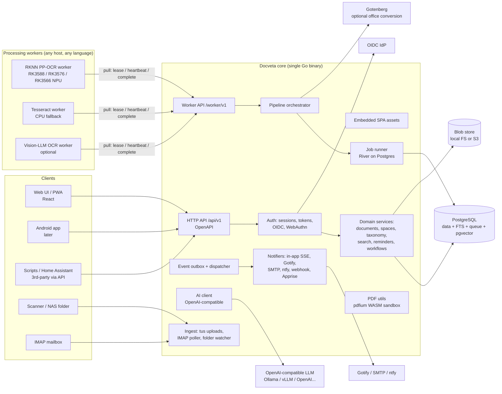
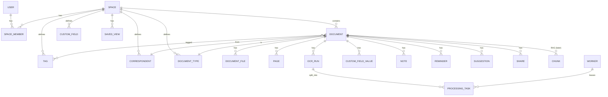
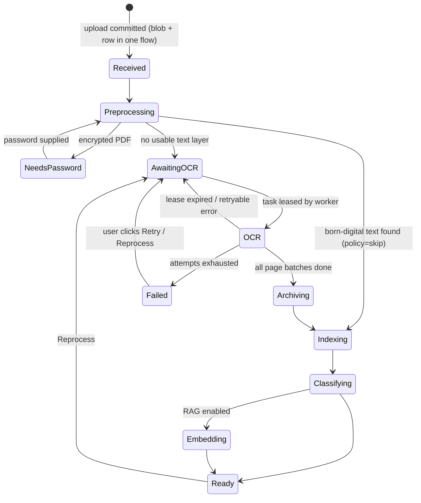
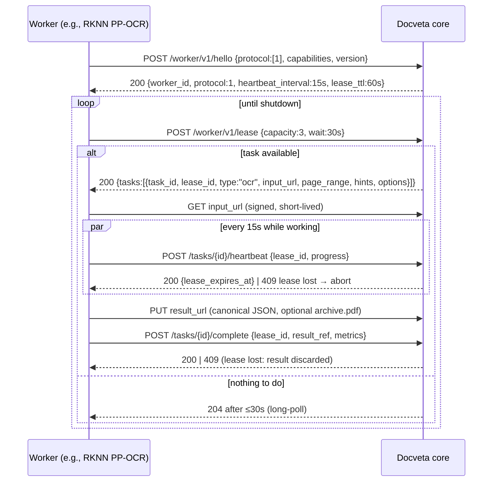

# Docveta — Self-Hosted Document Management System
## Requirements, Architecture & Design Document

| | |
|---|---|
| **Status** | Draft v0.1 — for review before implementation starts |
| **Date** | 2026-10-02 |
| **Name** | **Docveta** — confirmed |
| **For** | Households, small organisations, teams and offices — anyone who needs to capture, organise and find documents |
| **Audience** | You (product owner), me (implementer), future contributors |

---

## Table of Contents

1. [TL;DR](#1-tldr)
2. [How I interpreted your request](#2-how-i-interpreted-your-request)
3. [Vision, goals, non-goals, product principles](#3-vision-goals-non-goals-product-principles)
4. [Users, roles and key scenarios](#4-users-roles-and-key-scenarios)
5. [Functional requirements](#5-functional-requirements)
6. [Non-functional requirements](#6-non-functional-requirements)
7. [Architecture overview](#7-architecture-overview)
8. [Technology stack and why](#8-technology-stack-and-why)
9. [Domain model and data model](#9-domain-model-and-data-model)
10. [Document lifecycle and processing pipeline](#10-document-lifecycle-and-processing-pipeline)
11. [Processing engines (OCR) — pluggable worker architecture](#11-processing-engines-ocr--pluggable-worker-architecture)
12. [Search](#12-search)
13. [AI integration (OpenAI-compatible)](#13-ai-integration-openai-compatible)
14. [Semantic search and RAG (designed now, built later)](#14-semantic-search-and-rag-designed-now-built-later)
15. [Identity, authentication and permissions](#15-identity-authentication-and-permissions)
16. [Ingestion sources](#16-ingestion-sources)
17. [Events, notifications, workflows and reminders](#17-events-notifications-workflows-and-reminders)
18. [Public API and third-party integrations](#18-public-api-and-third-party-integrations)
19. [Storage, backup, export and migration](#19-storage-backup-export-and-migration)
20. [Frontend, UX and design system](#20-frontend-ux-and-design-system)
21. [Android readiness](#21-android-readiness)
22. [Security and privacy](#22-security-and-privacy)
23. [Deployment, configuration and operations](#23-deployment-configuration-and-operations)
24. [Edge cases and failure handling catalogue](#24-edge-cases-and-failure-handling-catalogue)
25. [Testing and quality strategy](#25-testing-and-quality-strategy)
26. [Repository layout and engineering conventions](#26-repository-layout-and-engineering-conventions)
27. [Roadmap and milestones](#27-roadmap-and-milestones)
28. [Decision log](#28-decision-log)
29. [Open questions for you](#29-open-questions-for-you)
30. [Glossary](#30-glossary)

---

## 1. TL;DR

- **What:** A self-hosted, open-source, lightweight document management system for households, small organisations and teams, comparable in purpose to paperless-ngx but simpler to use, faster on small hardware, API-first (for a future Android app), and with OCR deliberately **outside** the core.
- **Shape:** One **Go** binary (API + embedded React UI + background jobs) + **PostgreSQL** + any number of **external processing workers** (OCR on Rockchip NPU today, anything tomorrow). Three containers for a typical install.
- **Key architectural bets:**
  1. **PostgreSQL does four jobs** — relational data, full-text search, job queue, vector store (pgvector). Fewer moving parts = lightweight and reliable.
  2. **OCR engines are pull-based workers** speaking a small, versioned HTTP protocol. The core never knows *how* OCR is done, only *which capabilities* a worker advertises. NPU, CPU, GPU, cloud, or a vision LLM — all are just workers.
  3. **Spaces** (Personal, Family, Accounts Dept, Clients, …) are the single permission concept users need to understand.
  4. **Inbox-first UX** — new documents land in an Inbox with rule/AI suggestions; one click to accept. Everything advanced is progressively disclosed.
  5. **Contract-first API** (OpenAPI spec, enforced by tests) drives the TypeScript client now and the Kotlin client later.
  6. **AI is optional and provider-agnostic** (any OpenAI-compatible endpoint: Ollama, vLLM, LM Studio, llama.cpp, OpenAI, OpenRouter…). Off by default; per-Space privacy policy.
- **Works with zero optional components:** Without workers you still get upload, viewing, born-digital PDF text search, tagging and everything else. Without AI you still get rule-based auto-classification.

---

## 2. How I interpreted your request

Your requirements, restated so we agree on them:

| You said | I understood / decided |
|---|---|
| Lightweight, Go backend, React + modern UI | Go modular monolith, single static binary, React SPA embedded in it. Low idle RAM, ARM64-friendly. |
| Organize, search, "all necessary features" | Tags, correspondents, document types, custom fields, saved views, full-text search with filters, bulk edit, notes, reminders, sharing, trash, audit. See §5. |
| Modern, responsive, uncluttered, easy | Inbox-first workflow, command palette, progressive disclosure, mobile-first responsive layouts, a real design system (§20). |
| 3rd-party integrations and APIs | Public REST API (OpenAPI), API tokens, webhooks, OIDC, S3, IMAP, Gotify/ntfy/SMTP/Apprise, ICS calendar feed, paperless-ngx importer, MCP server later (§18). |
| Android app later | Every UI capability goes through the public API; resumable uploads; PKCE login; delta-sync change feed; push via UnifiedPush/ntfy (§21). |
| OIDC, Gotify, SMTP | First-class in v1 (§15, §17). |
| OCR separate, Rockchip NPU now, swappable / multiple engines | External pull-based workers with capability routing, priorities, fallback and a canonical result format (§11). Reference workers: RKNN PP-OCR (NPU), Tesseract (CPU), vision-LLM. |
| 10,000+ documents, many persons | Designed and load-tested for **100k documents / 1M pages / 50 users** so 10k is comfortable headroom (§6). |
| "Keep it simple" | **Confirmed meaning:** ship the *full* feature set, but the UX must stay easy to understand. Features are never removed for simplicity; they are layered (progressive disclosure, sensible defaults, plain language). See §3.4. |
| OpenAI-compatible integration for categorisation after OCR, search references, RAG later | AI classification/extraction pipeline stage now; data model, chunking and pgvector designed now so RAG ("Ask your documents" with citations) drops in later without migrations of existing data (§13, §14). |
| "I might have missed things" | I added what a real home or office archive needs: reminders for expiry dates, physical-original tracking (ASN), duplicate detection, password-protected PDFs, multi-language (incl. Indic scripts), backups/export, migration from paperless-ngx, audit log, trash. Each is marked with its phase. |

**Assumptions** (please correct any that are wrong — see §29):
- A1. Typical host is an ARM64 SBC with a Rockchip NPU — **RK3588/RK3588S, RK3576 or RK3566/RK3568** — or a small x86 server/NAS; core and NPU worker may be on the same box or different boxes (§11.7 has the per-SoC matrix).
- A2. Documents are mostly English with some Hindi/other Indic-script documents; dates commonly in DD/MM/YYYY.
- A3. Users are members of one household or organisation (from a family of 4 to an office of ~100) plus external guests via share links. One instance = one household/organisation; not a public multi-tenant SaaS.
- A4. You run (or may run) a reverse proxy with TLS (Caddy/Traefik/NGINX) and possibly an IdP (Authentik, Keycloak, Authelia, Pocket ID…).

---

## 3. Vision, goals, non-goals, product principles

### 3.1 Vision
> Every important document — bills, IDs, contracts, invoices, medical records, property papers, certificates, warranties, HR and vendor files — is captured once, found in seconds, shared with the right people, and never forgotten when it expires. At home or at work.

### 3.2 Goals
- G1. Capture from anywhere (browser, phone, scanner, email, folder) with near-zero effort.
- G2. Find any document in < 5 seconds of user effort (search-as-you-type, filters, saved views).
- G3. Automatic organisation (rules + optional AI), with human confirmation where it matters.
- G4. Privacy by default; clear, simple sharing between members (family, team or department).
- G5. Runs well on a single low-power ARM board; hardware-accelerated OCR is pluggable.
- G6. API-first platform that a native Android app and third-party tools can fully use.
- G7. Easy to operate: one `docker compose up`, automatic migrations, clear backup story.

### 3.3 Non-goals (explicitly out of scope)
- Not a file-sync tool (Nextcloud/Syncthing territory). No desktop sync client.
- Not a document editor or collaborative office suite. We store and annotate, not edit content.
- No e-signatures, no complex approval/BPM workflows (enterprise DMS territory).
- Not multi-tenant SaaS. One instance = one household/organisation.
- No OCR, ML inference or heavy image processing inside the core process.

### 3.4 Product principles (used to settle every UX debate)
0. **Full features, simple experience.** We do not cut features to look simple; we design so that every feature is easy to discover when needed and invisible when not.
1. **Simple by default, powerful on demand.** A new user needs to learn only: *Upload → Inbox → Documents → Search*. Custom fields, workflows, rules, workers, AI settings live behind Settings and never appear in the main flow until used.
2. **Never block the user on processing.** A document is viewable, downloadable and editable the moment upload finishes; OCR/AI enrich it in the background.
3. **Suggest, don't surprise.** Automation proposes; users accept with one click. Auto-apply is opt-in per Space and never overwrites something a human set.
4. **One concept for access: Spaces.** No per-object permission matrices in the main UI.
5. **Fast everywhere.** Every interaction under 100 ms perceived; lists virtualised; search-as-you-type.
6. **Your data is portable.** Original files are never modified; a full, human-readable export is always one command away.

---

## 4. Users, roles and key scenarios

### 4.1 Personas
| Persona | Description | Needs |
|---|---|---|
| **Admin (you)** | Sets up the server, workers, OIDC, AI | Health dashboards, worker status, backups, clear config |
| **Member** (family member / employee) | Uploads bills/invoices from phone, searches for documents | Zero-learning UI, fast search, phone capture |
| **Elder/low-tech member** | Mostly views shared documents | Big targets, simple language, local language UI |
| **Child/teen** | Views their own certificates/IDs | Restricted, read-only access to selected Spaces |
| **External helper** (accountant) | Needs a few documents at tax time | Expiring share link or a Viewer role on one Space |
| **Integration/script** | Home Assistant, scanner scripts, Android app | Stable API, tokens with scopes, webhooks |

### 4.2 Key scenarios (these drive acceptance tests)
- S1. Mom photographs an electricity bill on her phone → shares to Docveta → 30 s later it is OCR'd, titled "BESCOM Electricity Bill – Aug 2026", tagged *Utilities*, correspondent *BESCOM*, amount and due date extracted → she gets a reminder 3 days before due date.
- S2. Dad needs the car insurance policy at a traffic stop → opens app, types "car ins" → result in < 1 s → opens PDF.
- S3. You bulk-import 12,000 legacy scans from a NAS folder over a weekend; the NPU worker chews through them at low priority while uploads from other members still jump the queue.
- S4. Passport expires in 6 months → the "Expiry date" custom field triggers reminders to the owner at 180/90/30 days.
- S5. Accountant gets an expiring, password-protected link to a saved view "FY2025-26 Tax".
- S6. The NPU board is down → tasks wait, then (if configured) fall back to the CPU Tesseract worker after N minutes; the admin gets a Gotify alert "worker offline".
- S7. (Later) "When does our home loan interest certificate say the principal was paid?" → RAG answer with citations to page 2 of the certificate.

---

## 5. Functional requirements

Priority: **P0** = MVP (v0.1), **P1** = v0.2–v0.3, **P2** = v1.0, **P3** = later. Phases are detailed in §27.

### 5.1 Documents
| ID | Requirement | Pri |
|---|---|---|
| FR-D1 | Upload single/multiple files and folders via drag & drop anywhere, file picker, paste (Ctrl+V of images). | P0 |
| FR-D2 | Supported formats: PDF, JPEG, PNG, TIFF (multi-page), WebP; HEIC/HEIF (via worker `convert` capability); Office/ODF/EML/TXT (via optional Gotenberg / worker). | P0 / P1 |
| FR-D3 | Original file stored immutably; optional **archive version** (searchable PDF with text layer). | P0 |
| FR-D4 | In-browser viewer (pdf.js): zoom, rotate view, page thumbnails, search-in-document with highlights, download original/archive. | P0 |
| FR-D5 | Metadata: title, document date (date-only), added date, correspondent, document type, tags, language, page count, ASN, notes, custom fields. | P0 |
| FR-D6 | Custom fields typed: text, long text, integer, decimal, monetary (with currency, default INR), date, boolean, URL, select (single/multi), document link, and "date with reminder". | P1 |
| FR-D7 | Notes/comments on documents with @mentions of members (notification). | P1 |
| FR-D8 | Edit history / audit trail per document (who changed what, when). | P1 |
| FR-D9 | Soft delete to Trash; auto-purge after 30 days (configurable); restore. | P0 |
| FR-D10 | Duplicate detection by SHA-256 of original (per Space): warn, offer "open existing" or "keep both". | P0 |
| FR-D11 | Replace file / add new version while keeping metadata; previous versions retained. | P2 |
| FR-D12 | Page operations: rotate, delete pages, split, merge (produces a new derived original; old one kept as version). | P2 |
| FR-D13 | Document links ("related documents", e.g., invoice ↔ warranty). | P1 |
| FR-D14 | ASN (Archive Serial Number) auto-assignment + "physical location" field for paper originals; printable ASN labels. | P1 / P3 |
| FR-D15 | Password-protected PDFs: detect, ask for password, optionally store an unlocked copy. | P1 |

### 5.2 Organisation
| ID | Requirement | Pri |
|---|---|---|
| FR-O1 | Tags (hierarchical: `Finance/Tax`), colours, "inbox tag" semantics handled by the Inbox flag instead. | P0 |
| FR-O2 | Correspondents (people/organisations) and Document types. | P0 |
| FR-O3 | Matching rules per tag/correspondent/type: *none, any word, all words, exact phrase, regex, fuzzy*. | P1 |
| FR-O4 | Saved views (smart folders) = saved search + display settings; pin to sidebar/home; share within a Space. | P0 |
| FR-O5 | Bulk edit: add/remove tags, set correspondent/type/space, custom fields, delete, reprocess, download as ZIP. | P0 |
| FR-O6 | Merge taxonomy items (e.g., merge two duplicate correspondents). | P1 |

### 5.3 Search
| ID | Requirement | Pri |
|---|---|---|
| FR-S1 | Full-text search over OCR/extracted text + metadata, ranked, with highlighted snippets and "found on page N". | P0 |
| FR-S2 | Filters: space, tags (any/all/none), correspondent, type, date ranges, added range, custom field predicates, has-reminder, inbox, owner, language, processing status. | P0 |
| FR-S3 | Simple query language: `tax tag:finance from:hdfc type:invoice date:2025 amount>5000 "exact phrase" -draft`. Optional; UI chips build the same query. | P1 |
| FR-S4 | Typo/OCR-error tolerance (trigram fuzzy), prefix search for as-you-type. | P0 |
| FR-S5 | Command palette (Ctrl/Cmd+K): search documents, jump to views, run actions. | P0 |
| FR-S6 | "More like this" (similar documents). | P2 |
| FR-S7 | Semantic and hybrid search; "Ask" (RAG) with citations. | P2/P3 |

### 5.4 Processing & automation
| ID | Requirement | Pri |
|---|---|---|
| FR-P1 | Pipeline: preprocess → OCR (external) → archive PDF → index → classify (rules, AI) → embed → notify. Visible per-document status and progress. | P0 |
| FR-P2 | Skip OCR for born-digital PDFs that already have a text layer (policy: skip / redo / force). | P0 |
| FR-P3 | Pluggable OCR workers with capability routing, priorities, fallback, retry, and a workers dashboard. | P0 |
| FR-P4 | Reprocess a document or a selection with a chosen engine/profile; old results kept until the new run succeeds. | P0 |
| FR-P5 | Date, amount and identifier extraction (rule-based, locale-aware DD/MM vs MM/DD). | P1 |
| FR-P6 | AI suggestions (title, date, correspondent, type, tags, custom fields, summary) via OpenAI-compatible provider. | P1 |
| FR-P7 | Workflows: trigger → conditions → actions (set fields, move, notify, webhook, request review). | P1 |
| FR-P8 | Barcode/QR separator pages to split batch scans; ASN barcodes. | P2 |

### 5.5 Collaboration & access
| ID | Requirement | Pri |
|---|---|---|
| FR-A1 | Local accounts with Argon2id passwords; TOTP 2FA; passkeys (WebAuthn). | P0 / P1 |
| FR-A2 | OIDC login (Authentik, Keycloak, Authelia, Pocket ID, Google…), auto-provisioning, group→role mapping. | P0 |
| FR-A3 | Spaces with roles Owner / Editor / Viewer; every user gets a Personal Space. | P0 |
| FR-A4 | Share links: expiring, optional password, view-only or download, revocable, access-counted. | P1 |
| FR-A5 | Invitations by link or email. | P1 |
| FR-A6 | API tokens (personal access tokens) with scopes and expiry. | P0 |

### 5.6 Notifications, reminders, integrations
| ID | Requirement | Pri |
|---|---|---|
| FR-N1 | In-app notifications (real-time via SSE). | P0 |
| FR-N2 | Channels: Gotify, SMTP, ntfy, generic webhook (HMAC-signed), Apprise API bridge (for Telegram/Discord/etc.). | P0 (Gotify, SMTP) / P1 |
| FR-N3 | Per-user notification preferences per event type and channel; quiet hours. | P1 |
| FR-N4 | Reminders on documents (one-off/recurring, lead times), auto-created from "date with reminder" custom fields; ICS feed per user. | P1 |
| FR-N5 | Daily/weekly digest email (optional). | P2 |
| FR-I1 | Email (IMAP) import with rules. | P1 |
| FR-I2 | Watched folder (scanner drop folder / SMB share). | P1 |
| FR-I3 | Import from paperless-ngx export. | P1 |
| FR-I4 | Full export (portable) and import. | P1 |
| FR-I5 | MCP server for AI agents (read/search tools under user's permissions). | P3 |

### 5.7 Administration
| ID | Requirement | Pri |
|---|---|---|
| FR-X1 | First-run setup wizard (admin account, base URL, optional OIDC/AI/notifications/worker token). | P0 |
| FR-X2 | User & Space management, last-admin protection, user deactivation with Personal Space ownership transfer. | P0 |
| FR-X3 | System dashboard: queue depth, workers, storage usage, failed tasks with retry, version info. | P0 |
| FR-X4 | Audit log (security events + admin actions), filterable. | P1 |
| FR-X5 | CLI: `serve`, `migrate`, `user create/reset-password`, `export`, `import`, `import-paperless`, `reindex`, `doctor`. | P0 / P1 |

---

## 6. Non-functional requirements

| ID | Category | Target / requirement | How verified |
|---|---|---|---|
| NFR-1 | Scale | Comfortable at 10k docs; designed & load-tested at **100k docs, 1M pages, 50 users, 5 concurrent active**. No architectural limit before ~1M docs. | Synthetic dataset + k6 load tests in CI (nightly) |
| NFR-2 | Search latency | p95 < 300 ms for keyword search with filters at 100k docs on RK3588/RK3576-class hardware (RK3566-class: p95 < 800 ms at 50k docs); p95 < 100 ms for as-you-type title/prefix suggestions. | k6 + `EXPLAIN ANALYZE` regression checks |
| NFR-3 | UI performance | Initial JS for app shell < 200 KB gzipped; route-level code splitting; LCP < 2 s on mid-range Android over LAN; lists of 10k+ items virtualised. | Lighthouse CI, bundle-size budget check |
| NFR-4 | Footprint | Core idle RSS < 150 MB (excluding Postgres); Postgres tuned profile for 4–8 GB RAM hosts. | Measured in CI on arm64 runner |
| NFR-5 | Durability | No acknowledged upload is ever lost: blob fsync'd before DB commit; DB commit before 2xx. Jobs survive restarts (DB-backed queue). | Crash-injection integration tests |
| NFR-6 | Availability | Single-node design; graceful shutdown (drain HTTP, finish/return jobs); zero-downtime not required but restarts < 5 s. | Integration tests |
| NFR-7 | Security | OWASP ASVS L2 as guideline; strict CSP; no secrets in logs; dependency & container scanning in CI. | CI gates, threat model review |
| NFR-8 | Accessibility | WCAG 2.2 AA; full keyboard operation; screen-reader labels. | axe-core in Playwright tests |
| NFR-9 | i18n | UI translatable (i18next); Unicode NFC normalisation; Indic scripts render and search correctly; locale-aware dates/numbers/currency. | Fixture tests with Hindi/Marathi/Tamil samples |
| NFR-10 | Portability | linux/amd64 and linux/arm64 images; core is pure Go (no CGO) → static binary. | Multi-arch CI builds |
| NFR-11 | Compatibility | Public API `/api/v1` is backward compatible within v1; worker protocol versioned & negotiated. | Contract tests |
| NFR-12 | Observability | Structured JSON logs, Prometheus metrics, health/readiness endpoints, optional OpenTelemetry traces. | — |
| NFR-13 | Maintainability | Spec-checked API, plain SQL; ≥ 80 % coverage on domain packages; lint gates. | CI |

---

## 7. Architecture overview

### 7.1 Big picture



### 7.2 Why a modular monolith (not microservices)
- One household- or small-office-scale deployment does not need independent scaling of 10 services; it needs **one thing to deploy, upgrade and back up**.
- Go packages with strict boundaries (one package per bounded context, communicating through interfaces and domain events) give us the decoupling benefits without network hops, distributed transactions or extra containers.
- The **only** component that genuinely needs independent scaling, hardware placement and language freedom — **OCR/ML inference** — is the one we split out (workers).
- If a later need arises (e.g., run the IMAP poller elsewhere), the same binary can run with role flags (`serve --roles=api,jobs`) because all coordination goes through Postgres.

### 7.3 Internal layering (per bounded context)
```
transport (HTTP handlers generated from OpenAPI)  →  service (business rules, authorisation)
                                                   →  repository (plain SQL via pgx)
                                                   →  events (written to outbox in the same transaction)
```
- **Authorisation lives in the service layer**, not the handler, so every entry point (REST, workflows, MCP, CLI) gets the same checks.
- **Transactional outbox:** domain changes and their events commit atomically; a dispatcher delivers events to notifications, webhooks, workflows and the SSE hub. No lost or phantom events.

### 7.4 Bounded contexts (Go packages under `internal/`)
| Context | Responsibility |
|---|---|
| `identity` | users, sessions, API tokens, OIDC, WebAuthn, TOTP, invites |
| `spaces` | spaces, memberships, roles, authorisation policy |
| `documents` | documents, files/versions, pages, notes, links, trash, ASN, shares |
| `taxonomy` | tags, correspondents, document types, custom fields, matching rules |
| `storage` | blob store interface (FS, S3), signed URLs, GC |
| `pipeline` | stage orchestration, processing tasks, worker API, engine routing |
| `search` | query parsing, FTS, fuzzy, (later) hybrid retrieval |
| `ai` | provider registry, prompt templates, structured output, suggestions |
| `rag` | chunking, embeddings, retrieval, answer synthesis (P2+) |
| `ingest` | tus uploads, IMAP poller, folder watcher, importers |
| `automation` | workflows, reminders, scheduled jobs |
| `notify` | event subscriptions, channels, preferences, SSE hub |
| `audit` | audit log writer/reader |
| `platform` | config, logging, metrics, DB, migrations, secrets encryption, rate limiting |

---

## 8. Technology stack and why

### 8.1 Backend
| Concern | Choice | Why (and what I rejected) |
|---|---|---|
| Language | **Go** (latest stable, ≥ 1.26) | Your choice; also ideal: static binaries, low memory, great concurrency, cross-compiles to arm64. |
| HTTP | **net/http** (stdlib router with method+path patterns) + small middleware set | Stdlib routing is now sufficient; fewer deps. Rejected Gin/Echo/Fiber (unnecessary, Fiber isn't net/http-compatible). |
| API contract | **OpenAPI 3.0.3 spec** (`api/openapi.yaml`) kept in lock-step with handlers by tests (ADR-023) → `openapi-typescript` (web), OpenAPI Generator (Kotlin, later) | One contract, three clients, no drift. Rejected gRPC for public API (browser/Android friction, harder for hobby integrations).
| Database | **PostgreSQL 16+** (17/18 recommended) with `pg_trgm`, `unaccent`, `pgvector` | FTS + fuzzy + vectors + JSONB + `SKIP LOCKED` queues + LISTEN/NOTIFY in one engine. See ADR-002. |
| DB access | **pgx/v5** with hand-written SQL in repository files (ADR-022) | Plain, reviewable, tunable SQL with zero ORM magic. Rejected GORM/ent (hidden queries, harder perf tuning).
| Migrations | **goose** with embedded SQL files, run on startup under an advisory lock | Simple, supports Go migrations for data backfills. |
| Background jobs | **River** (Postgres-native job queue for Go) | Transactional enqueue (job inserted in the same tx as the document) → no orphaned state; retries, scheduling, uniqueness, priorities, UI-friendly. Rejected Redis/asynq (extra service), NATS (extra service). |
| External worker tasks | Own `processing_tasks` table with lease semantics | Workers are remote/untrusted-ish and multi-language; River is in-process only. See §11. |
| Uploads | **tus** resumable protocol (`tusd` as a library) + simple multipart for small files | Big scans and flaky mobile networks need resumability; Android has a mature tus client. |
| PDF utilities in core | **go-pdfium in WebAssembly mode (wazero)** | Page count, thumbnails, embedded-text extraction, encryption detection — in pure Go, no CGO, and **sandboxed** (a malicious PDF can't escape the WASM VM). Rejected shelling out to poppler (CGO/OS deps, weaker isolation). |
| Office docs | Optional **Gotenberg** sidecar (LibreOffice → PDF) | Only users who need .docx/.xlsx pay its cost. |
| Images | Go stdlib + `golang.org/x/image` (TIFF, WebP decode); thumbnails as WebP/JPEG | Pure Go. HEIC handled by a worker capability (libheif is C). |
| Auth libs | `coreos/go-oidc/v3`, `golang.org/x/oauth2`, `go-webauthn/webauthn`, `pquerna/otp`, `x/crypto/argon2` | Well-maintained, standard. |
| Logging/metrics | `log/slog` (JSON), Prometheus client, optional OpenTelemetry | Standard. |
| Config | Env vars (bootstrap) + DB-stored runtime settings (UI-editable) | 12-factor for infra, UI for everything a user should change. |

### 8.2 Frontend
| Concern | Choice | Why |
|---|---|---|
| Framework | **React 19 + TypeScript (strict)** + **Vite** | Your choice; Vite for fast builds; SPA is right because the app is behind login (no SEO/SSR need) and must be embeddable in the Go binary. Rejected Next.js (needs Node server at runtime → not lightweight). |
| Routing | **TanStack Router** | Fully type-safe routes & search params (filters live in the URL → shareable, back-button-correct). |
| Server state | **TanStack Query** | Caching, background refetch, optimistic updates, infinite queries. |
| Client state | **Zustand** (tiny, only for UI state like selection, upload queue) | Avoid Redux boilerplate. |
| Components | **shadcn/ui** (Radix primitives) + **Tailwind CSS v4** | Accessible primitives, we own the code (no vendor lock), easy theming via CSS variables → our design system. |
| Tables/lists | TanStack Table + TanStack Virtual | 10k+ rows smoothly. |
| Forms | react-hook-form + zod (zod schemas generated/aligned with OpenAPI) | Validation parity with backend. |
| PDF viewer | **pdf.js** (`pdfjs-dist`), lazy-loaded | De-facto standard, text layer for highlights. |
| Misc | `cmdk` (command palette), `sonner` (toasts), `lucide-react` (icons), `date-fns`, `i18next`, `@uppy/core` + tus plugin (uploads) | Small, proven. |
| PWA | Service worker (Workbox), installable, **Web Share Target** | Android users can "Share → Docveta" **before** the native app exists. |
| Testing | Vitest + Testing Library; Playwright e2e; axe-core | — |

### 8.3 Workers
| Worker | Stack | Why |
|---|---|---|
| Worker SDK | **Python** package `docveta-worker` (lease loop, heartbeats, retries, file download, PDF rasterisation via `pypdfium2`, text-layer PDF writer) | NPU/ML ecosystems (RKNN-Toolkit-Lite2, PaddleOCR, ONNX Runtime) are Python-first. SDK makes a new engine ≈ 100 lines: implement `recognize(page_image) -> lines/words`. Protocol is plain HTTP, so C++/Go/Rust workers are equally possible. |
| `worker-rknn` | Python + RKNN-Toolkit-Lite2 + PP-OCR det/cls/rec models converted to `.rknn` per SoC | Uses the NPU on RK3588/RK3588S (3 cores), RK3576 (2 cores) and RK3566/RK3568 (1 core); auto-detects the SoC. |
| `worker-tesseract` | Python + Tesseract 5 | Universal CPU fallback, 100+ languages incl. Hindi/Marathi/Tamil etc. |
| `worker-vlm-ocr` | Python + OpenAI-compatible vision endpoint | Handwriting, complex tables; any local VLM server. |

---

## 9. Domain model and data model

### 9.1 Core concepts
- **Space** — a container of documents and its own vocabulary (tags, correspondents, types, custom fields, saved views). Examples: "Anand (Personal)", "Family", "Accounts", "HR", "Client — Acme". Membership has a role.
- **Document** — the logical item users see. Has metadata and one or more **files**.
- **File** — a stored blob with a *kind*: `original`, `archive` (searchable PDF), `thumbnail`, `page_preview` (optional), `derived` (after split/merge). Content-addressed by SHA-256.
- **Version** — a new original replacing an old one; old files remain linked as previous versions.
- **Page** — per-page extracted text (+ reference to structured OCR JSON with coordinates).
- **OCR run** — one execution of an engine on a document version; results versioned so reprocessing never destroys good data.
- **Processing task** — a unit of external work (e.g., OCR pages 1–10) leased by a worker.
- **Suggestion** — a proposed value (from rule, AI or workflow) for a field, with source and confidence, pending user decision.

### 9.2 Why Spaces (and taxonomy scoped per Space)
Paperless-style per-object owner + per-user/per-group permissions are flexible but confusing ("why can't Dad / my manager see this?"). Spaces map to how people already think: *mine*, *ours*, *the Accounts department*, *client X*. Queries become a cheap `space_id = ANY($user_spaces)` filter which also keeps search and RAG retrieval fast and safe.

Taxonomy is scoped per Space because tag names themselves can be private (e.g., a medical condition tag in a personal space must not appear in a teenager's tag list). When a document moves between Spaces, its tags/correspondent/type are mapped **by name** to the target Space's vocabulary (created if missing, after a confirmation dialog listing what will be created).

Per-document **shares** (to a specific user or via link) cover the rare exception without introducing a permission matrix.

### 9.3 Entity-relationship sketch



### 9.4 Tables (key columns; all tables have `created_at`, `updated_at`)

**Identity**
- `users(id uuid pk, email citext unique, display_name, password_hash null, is_admin bool, locale, timezone, date_format, status[active|disabled], last_login_at)`
- `user_identities(id, user_id, provider, subject, email, email_verified, unique(provider, subject))` — OIDC links
- `sessions(id, user_id, token_hash, user_agent, ip, created_at, last_seen_at, expires_at, revoked_at)`
- `api_tokens(id, user_id, name, token_prefix, token_hash, scopes text[], expires_at, last_used_at, revoked_at)`
- `oauth_clients / oauth_codes / refresh_tokens` — for Android PKCE flow (§15.3)
- `webauthn_credentials(id, user_id, credential_id, public_key, sign_count, transports, name)`
- `totp_secrets(user_id pk, secret_encrypted, confirmed_at)`, `recovery_codes(user_id, code_hash, used_at)`
- `invites(id, email null, space_id null, role, token_hash, expires_at, used_at)`

**Spaces**
- `spaces(id, name, slug, kind[personal|shared], ai_policy[off|local_only|any], ai_apply_mode[suggest|auto], default_language, created_by)`
- `space_members(space_id, user_id, role[owner|editor|viewer], pk(space_id,user_id))`
- `oidc_group_mappings(id, group_claim_value, space_id null, role null, grants_admin bool)`

**Documents**
- `documents(id uuid, space_id, title, document_date date null, added_at, owner_id, correspondent_id null, document_type_id null, language, page_count, asn bigint unique null, physical_location null, inbox bool, status[processing|ready|failed|needs_attention], processing_stage, current_version int, content_hash, mime_type, size_bytes, original_filename, version int /*optimistic lock*/, change_seq bigint, deleted_at null, fts tsvector, title_trgm (via index))`
- `document_files(id, document_id, kind, version_no, blob_key, sha256, mime_type, size_bytes, width, height, page_count, encrypted bool)`
- `pages(document_id, version_no, page_no, text, ocr_run_id, confidence, rotation, width, height, fts tsvector, pk(document_id, version_no, page_no))`
- `ocr_runs(id, document_id, version_no, engine, engine_version, profile, status, started_at, finished_at, result_blob_key /*canonical JSON*/, avg_confidence, is_current bool)`
- `document_tags(document_id, tag_id, source[user|rule|ai|workflow])`
- `custom_field_values(document_id, field_id, value_text, value_number numeric, value_date date, value_bool, value_json jsonb, source)` — typed columns (not EAV-in-JSON) so filters/sorts are indexable
- `field_sources(document_id, field_name, source, set_by, set_at)` — tracks provenance of `title`, `document_date`, `correspondent`, `type` so automation never overwrites a user edit
- `notes(id, document_id, author_id, body, mentions uuid[])`
- `document_links(from_id, to_id, kind)`
- `shares(id, document_id null, saved_view_id null, created_by, token_hash, password_hash null, allow_download, expires_at, revoked_at, access_count)`
- `document_events(id, document_id, actor_id, action, diff jsonb, at)` — per-document history (audit-lite)

**Taxonomy** (all have `space_id`, unique `(space_id, lower(name))`)
- `tags(id, space_id, name, parent_id null, color, match_algorithm, match_pattern, case_sensitive)`
- `correspondents(...)`, `document_types(...)` — same matching columns
- `custom_fields(id, space_id, name, data_type, options jsonb, remind bool, remind_lead_days int[])`
- `saved_views(id, space_id null /*null = personal*/, owner_id, name, query jsonb, display jsonb, pinned bool, sort_order)`

**Pipeline**
- `processing_tasks(id, ocr_run_id null, document_id, type[ocr|archive|convert|barcode|...], requirements jsonb /*{languages, engine_tags, mime}*/, payload jsonb, priority smallint, status[queued|leased|done|failed|cancelled], attempt, max_attempts, lease_id, leased_by_worker_id, lease_expires_at, not_before, last_error, result jsonb)` with partial index on `(priority desc, created_at) where status='queued'`
- `workers(id, name, token_hash, protocol_version, capabilities jsonb, version, last_seen_at, status, enabled)`
- `processing_profiles(id, name, rules jsonb)` — routing/fallback policy (§11.6)
- River's own tables for internal jobs.

**AI / RAG**
- `ai_providers(id, name, base_url, api_key_encrypted, is_local bool, chat_model, vision_model null, embedding_model null, max_concurrency, timeout_s, extra_headers_encrypted)`
- `suggestions(id, document_id, field, proposed_value jsonb, source[rule|ai|workflow], provider_id null, model, confidence real, status[pending|accepted|rejected|superseded], decided_by, decided_at)`
- `embedding_spaces(id, provider_id, model, dimensions, distance, is_active)`
- `chunks(id, document_id, space_id /*denormalised for filtering*/, version_no, chunk_no, page_from, page_to, text, token_count, embedding_space_id, embedding halfvec(N))` — one physical table per embedding space (`chunks_<id>`) because a vector column has a fixed dimension; see §14.

**Automation & notifications**
- `workflows(id, space_id, name, enabled, trigger jsonb, conditions jsonb /*same query AST as search*/, actions jsonb, order)`
- `reminders(id, document_id, title, due_date date, recurrence rrule null, lead_days int[], notify_user_ids uuid[], source[user|custom_field], last_fired_at, completed_at)`
- `notification_channels(id, owner_id null /*null = system*/, type[gotify|smtp|ntfy|webhook|apprise], config_encrypted, enabled)`
- `notification_prefs(user_id, event_type, channel_ids uuid[], enabled)`
- `notifications(id, user_id, event_type, title, body, link, read_at)`
- `webhooks(id, owner_id, url, secret_encrypted, events text[], enabled, failure_count)`
- `outbox(id bigserial, event_type, payload jsonb, created_at, dispatched_at)`
- `mail_accounts(id, space_id, host, port, tls, username, password_encrypted, folder, poll_interval)`, `mail_rules(...)`

**Platform**
- `settings(key pk, value jsonb, updated_by)`
- `audit_log(id, at, actor_id, actor_type[user|token|worker|system], action, target_type, target_id, ip, user_agent, details jsonb)`
- `changes` — global change sequence (see §21.3) via `change_seq` columns + `tombstones(entity_type, entity_id, space_id, change_seq, deleted_at)`.

### 9.5 Important modelling decisions
- **UUIDv7 primary keys** — time-ordered (good index locality), safe to expose, generatable offline by the Android app.
- **`document_date` is a `date`, not a timestamp.** A bill dated 5 Aug is 5 Aug in every timezone. All other times are `timestamptz` in UTC; UI renders in the user's timezone.
- **Monetary values** as `numeric` + ISO-4217 currency code; never floats.
- **Optimistic concurrency** via `documents.version` + HTTP `ETag`/`If-Match` → two members editing the same document get a friendly "changed by Mom 10 s ago — reload / overwrite" instead of silent loss.
- **Soft delete** via `deleted_at`; partial indexes exclude deleted rows.
- **Text normalisation:** all extracted text NFC-normalised; `unaccent` for Latin; search tokens lower-cased.

---

## 10. Document lifecycle and processing pipeline

### 10.1 State machine



Throughout, the document is **already visible and usable**. Status is shown as a small, unobtrusive progress indicator, not a blocking spinner.

### 10.2 Stages
| Stage | Where | What it does | Idempotency key |
|---|---|---|---|
| **Receive** | core (HTTP / tus / IMAP / folder) | Stream to temp file, compute SHA-256 while streaming, sniff MIME from bytes (never trust extension/headers), enforce size limit, move into blob store (fsync), insert `documents` + `document_files` + River job **in one DB transaction**. | content hash + upload id |
| **Preprocess** | core (pdfium-WASM) | Page count, encryption check, embedded-text extraction, thumbnail (first page, WebP), basic metadata (PDF title/author/creation date as hints). Images: dimensions, EXIF orientation fix for thumbnail. Office: send to Gotenberg → derived PDF. HEIC/other: create `convert` task for a worker. | document version |
| **OCR decision** | core | If text layer exists and covers ≥ X % of pages with plausible text (heuristics: char count/page, ratio of printable chars) → skip per policy. Mixed PDFs → OCR only the pages lacking text. | — |
| **OCR** | external workers | Split into page batches (default 10 pages/task) → `processing_tasks`. Workers lease, OCR, upload canonical JSON per batch. | task id + lease id |
| **Archive** | external worker with `pdf.textlayer` capability | Build searchable PDF (invisible text layer from word boxes) once all batches finish. Skipped when the engine returns no coordinates (e.g., VLM) or the policy says "no archive". | ocr_run id |
| **Index** | core | Write `pages.text`, compute `pages.fts` and `documents.fts` (weighted: title A, correspondent/tags/type B, custom fields/notes C, content D). | ocr_run id |
| **Classify** | core | 1) matching rules, 2) date/amount extraction, 3) AI (if Space policy allows), 4) workflows. Writes **suggestions** or applies values (auto mode). | document version + classifier version |
| **Embed** | core → embedding provider | Chunk & embed (P2+). | document version + embedding space |
| **Notify** | outbox | `document.processed`, `document.needs_review`, `document.failed`. | event id |

### 10.3 Priorities and fairness
- Priority classes: **interactive** (user uploads, phone shares) > **normal** (email, folder) > **bulk** (imports, reprocess-all) > **background** (re-embedding).
- Leasing orders by priority, then age; bulk jobs additionally pass through a per-source concurrency cap so a 12k-document import never starves a member's upload (scenario S3).
- Users see queue position for their own processing documents ("3 ahead of you").

### 10.4 Reprocessing safety
A reprocess creates a **new `ocr_run`**; the current one stays `is_current=true` until the new run fully succeeds, then flips atomically. A failed reprocess never degrades search.

---

## 11. Processing engines (OCR) — pluggable worker architecture

This is the area you asked to be designed most carefully: Rockchip NPU today, other or multiple engines later.

### 11.1 Requirements for the engine layer
- E1. Core has **zero** knowledge of engine internals; engines are replaceable without core changes.
- E2. Multiple engines at once, on multiple machines; route by capability (language, file type, hardware tag), with priority and fallback.
- E3. Horizontal scale: add a second NPU board → throughput roughly doubles, no config beyond a token.
- E4. Fault tolerance: worker crash/network loss never loses a task; no task is completed twice.
- E5. Works across NAT/LAN without the core needing to reach the worker.
- E6. Engine-agnostic **canonical result** so search, highlights and the text-layer PDF work the same for every engine.
- E7. Observable: per-worker throughput, errors, versions, online status.
- E8. Secure: workers authenticate; they get only the files for tasks they leased, via short-lived URLs.

### 11.2 Decision: pull-based leasing over HTTP (ADR-004)
- **Pull (workers poll/long-poll the core)** rather than push: workers can sit behind NAT or on a different VLAN, there is natural back-pressure (a worker only asks for what it can handle), no service discovery, and scaling = start another worker.
- **HTTP/JSON** rather than gRPC or a message broker: trivially implementable in Python/C++/Go/Rust, debuggable with `curl`, works through reverse proxies; large files move as plain HTTP downloads/uploads. A broker (NATS/RabbitMQ/Redis) would add a service for no gain at this scale.
- **Leases with heartbeats**: a task leased by a worker is invisible to others until its lease expires. Heartbeats extend the lease. Completion must present the current `lease_id`, so a slow "zombie" worker can never overwrite a re-leased task.

### 11.3 Worker protocol v1

All endpoints under `/worker/v1`, authenticated with `Authorization: Bearer <worker-token>` (created in Admin → Workers; shown once). Every response carries `Docveta-Protocol: 1`.



**`POST /hello`** — capability advertisement (re-sent on every start and whenever capabilities change):
```json
{
  "protocol": [1],
  "worker": { "name": "rk3588-npu-1", "version": "0.3.0", "host": "rock5b" },
  "capabilities": [
    {
      "task_type": "ocr",
      "engine": "ppocr-rknn",
      "engine_version": "PP-OCRv4-rknn-2.3",
      "languages": ["en", "hi"],
      "input_mime": ["application/pdf", "image/png", "image/jpeg", "image/tiff"],
      "outputs": ["words", "lines", "bbox", "confidence", "rotation"],
      "max_pages_per_task": 20,
      "concurrency": 3,
      "tags": ["npu", "rk3588", "fast"]
    },
    { "task_type": "archive", "engine": "docveta-textlayer", "outputs": ["pdf"], "concurrency": 1 }
  ]
}
```

**`POST /lease`** — returns up to `capacity` tasks whose `requirements` are satisfied by this worker's capabilities (SQL: `... WHERE status='queued' AND not_before <= now() AND requirements <@ $caps ORDER BY priority DESC, created_at FOR UPDATE SKIP LOCKED LIMIT $n`). Long-polls using Postgres `LISTEN/NOTIFY` so idle workers cost nothing.

**Task payload:**
```json
{
  "task_id": "0192…", "lease_id": "…", "type": "ocr", "attempt": 1,
  "lease_expires_at": "2026-10-02T10:00:60Z",
  "input": { "url": "https://docveta.local/worker/v1/files/…sig…", "mime": "application/pdf", "sha256": "…", "size": 1830021 },
  "page_range": [11, 20],
  "hints": { "languages": ["en", "hi"], "dpi": 300, "deskew": true, "detect_rotation": true },
  "result": { "upload_url": "https://…/worker/v1/tasks/0192…/result?sig=…", "max_bytes": 52428800 }
}
```

**Errors:** `POST /tasks/{id}/fail {lease_id, code, message, retryable}`. Standard codes: `unsupported_input`, `corrupt_input`, `language_unavailable`, `engine_error`, `resource_exhausted`, `timeout`. Non-retryable codes skip remaining attempts *for this engine* and trigger fallback routing.

**Graceful shutdown:** `POST /tasks/{id}/release {lease_id}` returns a task to the queue immediately instead of waiting for lease expiry.

**Versioning:** core supports protocol `N` and `N-1`; `hello` negotiates the highest common version; incompatible workers get `426 Upgrade Required` with a clear message in the admin dashboard.

### 11.4 Canonical OCR result (`ocr-result/v1`)
```json
{
  "schema": "ocr-result/v1",
  "engine": { "name": "ppocr-rknn", "version": "PP-OCRv4-rknn-2.3", "models": { "det": "…", "rec": "…" } },
  "pages": [
    {
      "page": 11, "width": 2480, "height": 3508, "unit": "px", "dpi": 300,
      "rotation": 0, "language": "en", "confidence": 0.94,
      "text": "full page text in reading order…",
      "blocks": [
        { "bbox": [120, 210, 2300, 380], "type": "text",
          "lines": [
            { "bbox": [120, 210, 2300, 260], "text": "BESCOM Electricity Bill", "confidence": 0.98,
              "words": [ { "bbox": [120, 210, 520, 260], "text": "BESCOM", "confidence": 0.99 } ] }
          ] }
      ]
    }
  ],
  "metrics": { "ms_total": 3120, "ms_per_page": 312, "device": "npu" }
}
```
- `words` and `bbox` are **optional**. Engines that only return text (e.g., vision LLMs) still work: search works, but no archive text layer and no in-image highlight; the UI falls back to text-view highlighting.
- `type` on blocks is open-ended (`text`, `table`, `figure`, `handwriting`) — ready for layout-aware engines.
- Core validates the result against a JSON Schema; invalid results are a non-retryable `engine_error`.

### 11.5 What runs where (and why)
| Step | Location | Rationale |
|---|---|---|
| Rasterising PDF pages for OCR | **Worker** (SDK, `pypdfium2`) | Keeps CPU-heavy work off the core; workers with native PDF input skip it. |
| Deskew, rotation detection, binarisation | **Worker** | Engine-specific (PP-OCR has its own angle classifier). |
| Text-layer (searchable) PDF | **Worker** with `archive` capability (SDK-provided, engine-agnostic, consumes canonical JSON) | Needs mature PDF writing (fonts/invisible text); Python has it (pikepdf/hOCR-transform approach). Any worker can provide it. |
| Thumbnails, page count, embedded text | **Core** (pdfium WASM) | Cheap, needed instantly, even with no worker online. |

### 11.6 Routing, fallback and multiple engines
`processing_profiles` (admin-editable, sensible defaults shipped):
```yaml
name: default
ocr:
  prefer:            # tried in order; a task is offered to workers matching ANY entry, ranked by order
    - { engine_tags: [npu] }
    - { engine: tesseract }
  fallback_after: 15m       # if no preferred worker leases it in 15 min, widen to next entry
  on_non_retryable_error: next_engine
  languages_from: [space_default, detected, user_hint]
  page_batch_size: 10
archive: { enabled: true }
skip_ocr_when_text_layer: true
```
- Profiles can be selected per Space, per ingestion source (e.g., IMAP → `default`, legacy import → `bulk-cpu-ok`), or per manual reprocess.
- **Language routing:** if a document needs `hi` and the NPU worker lacks a Hindi model, those tasks go only to workers advertising `hi`.
- **Ensemble (P3):** optional "best-of" mode that runs two engines and keeps the higher-confidence page result — the canonical format makes this a core-side merge.

### 11.7 Rockchip NPU reference worker (`worker-rknn`) — RK3588, RK3576, RK3566/RK3568

One worker image supports all three SoC families. It **auto-detects the SoC** at start-up (from `/proc/device-tree/compatible`, overridable with `DOCVETA_RKNN_SOC`) and loads the matching model set and runtime profile.

**Supported SoC matrix**

| SoC | NPU (vendor spec) | NPU cores | Worker concurrency | Core binding | Default detection input | Recommended models | Notes |
|---|---|---|---|---|---|---|---|
| **RK3588 / RK3588S** | 6 TOPS | 3 | 3 contexts | one context per core (`NPU_CORE_0`, `_1`, `_2`) | 960 × 960 tiles | PP-OCR *server* or *mobile* det + rec | Highest throughput; can also run 1 context on `NPU_CORE_0_1_2` for very large single images. |
| **RK3576** | 6 TOPS | 2 | 2 contexts | one context per core (`NPU_CORE_0`, `_1`) | 960 × 960 tiles | PP-OCR *mobile* det + rec | Same software stack as RK3588 with a different `target_platform`. |
| **RK3566 / RK3568** | ~0.8 / 1 TOPS | 1 | 1 context | `NPU_CORE_AUTO` (no multi-core masks) | 640 × 640 tiles | PP-OCR *mobile* det (INT8) + rec (FP16) | Low-power option; slower per page, so the worker advertises `tags: [npu, low-power]` and a lower `max_pages_per_task`. Large backlogs can additionally use a CPU worker. |

**How each SoC is supported**
- **Models are compiled per platform.** An `.rknn` file is tied to its `target_platform`, so the repo ships a conversion script (`workers/rknn/convert/convert.py`, runs on x86 with RKNN-Toolkit2) that produces `models/<soc>/{det,rec_<script>}.rknn` for `rk3588`, `rk3576`, `rk3566` (RK3566 models also run on RK3568). Detection is INT8-quantised with a calibration set of the user's own sample documents; recognition stays FP16 (INT8 raises character errors) and is compiled for several fixed input widths (320/640/960/1280 at height 48) using RKNN dynamic-input shapes.
- **Runtime:** RKNN-Toolkit-Lite2 (Python) on the board, which supports all three families; the worker checks the installed `librknnrt` version and the kernel driver version at `hello` and reports a clear, actionable error if they don't match.
- **Concurrency = NPU cores.** Each inference context is pinned to one core, so `concurrency` advertised to the core equals the number of NPU cores; the core then leases at most that many page batches to the worker.
- **Static shapes:** NPUs perform best with fixed input shapes, so the worker resizes/pads detection input into fixed-size tiles (sizes above, overlapping so text lines are not cut; boxes merged in post-processing) and buckets recognition crops by width at a fixed height (48 px).
- **CPU parts** (image decode, rasterisation, detection post-processing, text-layer PDF) run in a thread pool on the CPU cores so the NPU stays busy (pipeline: decode → detect → crop → recognise).
- **Languages:** recognition models are per script (Latin/English, Devanagari, …); only the ones present in `models/<soc>/` are advertised in `languages`, so the router (§11.6) sends other languages to a worker that has them (e.g., Tesseract).
- **Benchmarks:** `docveta-worker-rknn bench` runs a fixed fixture set and prints pages/min and character error rate (CER) per SoC. We publish measured numbers, not guesses.
- **Container:** one multi-SoC `linux/arm64` image. Needs the NPU device passed through (`/dev/rknpu` on BSP kernels, or the DRM render node on mainline-style kernels) and the vendor runtime library; documented for Rockchip BSP, Armbian and Ubuntu-Rockchip images.

### 11.8 Writing a new engine
```python
from docveta_worker import Engine, Page, run

class MyEngine(Engine):
    name, version, languages, tags = "my-ocr", "1.0", ["en"], ["gpu"]
    def recognize(self, page: Page) -> list[Line]: ...   # page.image is a PIL/numpy image

run(MyEngine())   # SDK does hello, lease, heartbeats, rasterisation, result upload, archive PDF
```
Plus a **conformance test kit** (`docveta-worker test --engine my_engine.py`) that runs fixtures through the engine and validates protocol behaviour and result schema.

---

## 12. Search

### 12.1 Decision: PostgreSQL FTS + pg_trgm first, behind a `SearchIndex` interface (ADR-003)
- For 10k–100k documents, Postgres `tsvector` + GIN with weighted ranking is fast and **transactionally consistent** (no "saved but not yet indexed" lag, no separate index to rebuild after restore, permission filters in the same query).
- `pg_trgm` covers typo/OCR-noise tolerance and as-you-type prefix matching on titles/correspondents.
- The `SearchIndex` interface (Index, Delete, Query) lets us add an adapter later (e.g., Meilisearch/Typesense or ParadeDB `pg_search` for BM25) **without changing the API**, if relevance at large scale demands it. Rejected for v1: Elasticsearch/OpenSearch (far too heavy), Meilisearch (extra service + sync + permission filtering complexity), Bleve (index outside the DB → backup/consistency burden).

### 12.2 Indexing details
- `documents.fts = setweight(title,'A') || setweight(correspondent+type+tags,'B') || setweight(custom fields+notes,'C') || setweight(content,'D')`.
- **Dual configuration:** each text is indexed with the document's language config (e.g., `english` with stemming) **and** the `simple` config (no stemming). This ensures Indic scripts (where Postgres stemming support is limited), proper nouns, and identifiers like PAN/GSTIN/policy numbers still match exactly.
- Identifier-aware tokenisation: numbers like `ABCDE1234F` or `1234-5678-9012` are also indexed in normalised forms (no separators) so users can type them either way.
- Page-level `pages.fts` gives "found on page N" and per-page snippets via `ts_headline` (computed only for the visible page of results, never for the whole result set — `ts_headline` is expensive).
- Very large texts: Postgres `tsvector` has a 1 MB limit; content beyond a safe cap is indexed at page level only (documented, tested with a 2,000-page PDF).

### 12.3 Query pipeline
1. Parse user input (query language → AST). Free text → `websearch_to_tsquery` (supports quotes and `-exclude`) on both configs, OR'ed.
2. Apply **mandatory permission filter** (`space_id = ANY(:spaces) OR id IN (shared_with_me)`) first.
3. Apply filters (tags, dates, fields…) — all indexed (B-tree on FK/date columns, GIN on tag arrays via join table indexes).
4. Rank: `ts_rank_cd` weighted + small recency boost; fuzzy trigram matches merged when FTS yields few results.
5. Keyset pagination (`(rank, id)` cursor) — never `OFFSET` for deep pages.
6. Facet counts (tags, types, correspondents, years) computed on the filtered set with a cap, cached briefly per user+query.

### 12.4 Query language (optional for users; chips build it for them)
```
electricity bill tag:utilities from:bescom type:bill date:2026-01..2026-06
added:>30d amount:>1500 has:reminder is:inbox space:family lang:hi "due date" -draft
```
The same AST powers saved views, workflow conditions and the API, so behaviour is identical everywhere.

---

## 13. AI integration (OpenAI-compatible)

### 13.1 Scope
- **P1:** Classification & extraction after OCR — title, document date, correspondent, document type, tags, custom fields (amount, due date, policy number, expiry date…), short summary, language.
- **P2:** Semantic search, "similar documents", embeddings.
- **P3:** "Ask" (RAG chat with citations), MCP tools.

### 13.2 Provider abstraction
- One `ai.Provider` interface over the **OpenAI-compatible HTTP API** (`/v1/chat/completions`, `/v1/embeddings`, `/v1/models`). Works with Ollama, LM Studio, vLLM, llama.cpp server, LocalAI, OpenRouter, OpenAI, Azure-compatible gateways, and any local server you may run on the RK3588 that exposes this API.
- Multiple providers configurable; each *capability* (chat, vision, embeddings) is mapped to a provider+model separately (e.g., local Ollama for embeddings, a bigger remote model for classification).
- Per-provider: base URL, API key (encrypted at rest), custom headers, timeout, max concurrency, requests/min, `is_local` flag (admin-declared), and a "test connection" button that lists models and runs a sample prompt.
- Feature detection: try **structured outputs** (`response_format: json_schema`); if unsupported, fall back to `json_object` mode; if unsupported, to prompt-only JSON with strict parsing + one repair retry.

### 13.3 Classification flow
1. **Rules first** (cheap, deterministic): matching rules and extractors fill what they can.
2. **Build prompt** with: the Space's allowed vocabulary (tags/correspondents/types/custom fields with descriptions), the document's first N tokens (default ~3,000; configurable) plus the first/last page (where dates/amounts live), filename and any PDF metadata hints, user locale (DD/MM), and **few-shot examples from the user's own recent corrections** in that Space (cheap "learning" without fine-tuning).
3. **Large vocabularies:** if a Space has > 150 tags, pre-select the top-K candidates by trigram/embedding similarity to keep prompts small and accurate.
4. **Response schema** (JSON Schema, validated server-side):
```json
{
  "title": "string",
  "document_date": "YYYY-MM-DD|null",
  "correspondent": { "id": "uuid|null", "new_name": "string|null" },
  "document_type": { "id": "uuid|null", "new_name": "string|null" },
  "tags": [ { "id": "uuid|null", "new_name": "string|null" } ],
  "custom_fields": { "<field_id>": "value" },
  "summary": "string",
  "language": "bcp47",
  "confidence": { "title": 0.0, "document_date": 0.0, "correspondent": 0.0, "document_type": 0.0, "tags": 0.0 }
}
```
5. **Guardrails:** IDs must exist in the Space; `new_name` entries are allowed only if the Space allows AI to propose new items (default: propose, never auto-create); dates must parse and be plausible (not in the far future unless the field is an expiry/due date); values are type-checked against custom field definitions.
6. **Output → suggestions.** In `suggest` mode they appear in the Inbox with per-field Accept/Reject and an "Accept all" button. In `auto` mode, fields above a confidence threshold are applied (source=`ai`), the rest stay suggestions. **Nothing a user set manually is ever overwritten** (`field_sources`).
7. User decisions are stored and feed the few-shot examples and accuracy stats per Space ("AI suggestions accepted 87 % this month").

### 13.4 Privacy controls
- AI is **off by default** for the instance.
- Each Space has an `ai_policy`: `off` / `local_only` (only providers flagged `is_local`) / `any`. E.g., "Medical" Space = `local_only`.
- A clear UI notice states what is sent (document text, vocabulary) when enabling a non-local provider.
- Prompts and responses are not logged by default; a debug toggle logs them redacted for 24 h.

### 13.5 Cost and robustness
- Concurrency/rate limits per provider, exponential backoff with jitter on 429/5xx, circuit breaker after repeated failures (alert admin), timeouts.
- Classification is a separate pipeline stage; AI outages never block OCR, indexing or the document becoming `ready` (it becomes `ready` with "AI pending").
- Token budgeting: long documents use first/last pages + a map-reduce summary only when the user explicitly asks for a full summary.

---

## 14. Semantic search and RAG (designed now, built later)

### 14.1 Why design it now
So we don't need disruptive migrations later: chunk boundaries align with **pages** (citations need page numbers), Space is denormalised on chunks (security filter inside the vector index scan), and embedding models are versioned (you *will* change models).

### 14.2 Chunking
- Unit: text from the current OCR run, per page, split by layout blocks/paragraphs into ~400–800 token chunks with ~15 % overlap; never cross document boundaries; a chunk may span at most 2 pages (records `page_from/page_to`).
- Each chunk is prefixed with a short context header (title, correspondent, type, date) — significantly improves retrieval for short chunks.
- Re-chunk/re-embed is triggered on new OCR run, metadata change (header), or embedding model change.

### 14.3 Storage and versioning
- `embedding_spaces` = (provider, model, dimensions, distance). One chunks table per embedding space (fixed vector dimension), `halfvec` to halve storage (also allows HNSW on > 2,000-dim models).
- Changing the model creates a new embedding space, back-fills it at `background` priority, and switches atomically when complete. Old space is dropped afterwards.
- HNSW index with pgvector **iterative index scans** so `WHERE space_id = ANY(...)` filters still return enough results.

### 14.4 Retrieval
- **Hybrid:** FTS (keywords, exact identifiers) + vector similarity, fused with **Reciprocal Rank Fusion**; optional re-ranker model via the same OpenAI-compatible provider if available.
- Permission filter is applied **in SQL**, before ranking — the LLM never sees text the user can't access.

### 14.5 "Ask" (P3)
- Question → hybrid retrieve top-k chunks → answer with mandatory inline citations `[doc:title, p.2]` linking to the viewer at that page with highlight → "I couldn't find this in your documents" when retrieval confidence is low (no hallucinated answers).
- Conversations stored per user, deletable; Space AI policy respected (local-only Spaces are retrieved only when the chat model is local).

---

## 15. Identity, authentication and permissions

### 15.1 Login methods
- **Local accounts:** email + password (Argon2id, OWASP-recommended parameters, tuned for ARM), optional TOTP, passkeys; recovery codes.
- **OIDC:** Authorization Code + PKCE via `go-oidc`. Config: issuer, client ID/secret, scopes, claim mappings (`email`, `name`, `groups`), allowed groups, auto-provision on/off, "OIDC-only" mode (hides password login), RP-initiated logout.
  - **Account linking:** an OIDC login whose verified email matches an existing local user links only if the admin enabled "link by verified email"; otherwise the user links from Settings while logged in. Prevents account takeover via a misconfigured IdP.
  - **Group mapping:** `groups` claim values map to admin flag and/or Space roles, re-evaluated on each login.
- Rate-limited login with progressive delay and temporary lockout; all auth events audit-logged.

### 15.2 Sessions (web)
- Opaque random session token in `__Host-docveta_session` cookie (`HttpOnly; Secure; SameSite=Lax; Path=/`), stored hashed server-side → instant revocation, "log out other devices", session list in Settings.
- Sliding expiry (e.g., 30 days idle, 90 days absolute); re-authentication required for sensitive actions (change password, create API token, admin changes).
- **CSRF:** SameSite=Lax + verification of `Origin`/`Sec-Fetch-Site` on all state-changing cookie-authenticated requests.

### 15.3 Tokens (API, Android, integrations)
- **Personal access tokens** (`dvt_pat_…`), scoped (`documents:read`, `documents:write`, `upload`, `admin`…), optional expiry, hashed at rest, prefix shown for identification.
- **Android/native apps:** Docveta acts as an OAuth 2.1 authorization server for its own first-party public client: system browser → `/oauth/authorize` (which itself may redirect to the OIDC IdP) → PKCE code → app-scheme redirect → `/oauth/token` → short-lived opaque **access token** (15 min) + **rotating refresh token** with reuse detection. This means the Android app works the same whether you use local login or any OIDC provider.
- Decision: **opaque tokens, not JWTs** (ADR-007) — single server, DB lookup is cheap, revocation is immediate and simple.

### 15.4 Authorisation model
| Role | Scope | Can |
|---|---|---|
| **Instance admin** | global | manage users, Spaces, workers, providers, settings, see audit log. *Does not automatically see all documents* — admins must be members of a Space (privacy between adults/colleagues). Break-glass "take ownership" is possible but audit-logged and notified to Space owners. |
| **Space Owner** | Space | everything in the Space incl. members, vocabulary, workflows, AI policy, delete Space |
| **Space Editor** | Space | upload, edit metadata, tag, delete to trash, create saved views |
| **Space Viewer** | Space | view, download, search, comment (comment toggleable) |
| **Share recipient** | single document / saved view | view (+download if allowed) |

Policy is implemented in one place (`spaces.Authorizer`) and covered by a table-driven test matrix (role × action × resource state).

---

## 16. Ingestion sources

| Source | Design | Pri |
|---|---|---|
| **Web upload** | Drag & drop anywhere, multi-file and folder; tus for files > 5 MB, multipart for small ones; per-file progress; choose Space (defaults to last used); optional tags at upload. | P0 |
| **PWA share target** | Android "Share → Docveta" for PDFs/images (Web Share Target, POST multipart). | P0 |
| **API** | `POST /api/v1/documents` (multipart) and tus endpoint; `Idempotency-Key` header supported. | P0 |
| **Watched folder** | Polling + fsnotify hybrid (fsnotify is unreliable on SMB/NFS mounts, so polling is the source of truth); waits until a file is stable (size/mtime unchanged for N s) before ingest; sub-folder → Space/tag mapping; processed files moved to `done/` or deleted (configurable); failures to `failed/` with a `.error.txt`. | P1 |
| **Email (IMAP)** | Per-account polling (IMAP IDLE when supported); rules: from/to/subject/body regex, attachment types/min size, target Space/tags/correspondent; action after processing: mark read/move/flag/delete; optionally ingest the email body itself as a document (EML → PDF via Gotenberg). Message-ID based de-dup. | P1 |
| **Bulk import** | CLI + UI wizard for a server-side directory; resumable; low priority; dry-run report. | P1 |
| **paperless-ngx importer** | Reads paperless `document_exporter` output (manifest + files): tags, correspondents, types, custom fields, notes, ASNs, dates, owners → Spaces; keeps existing OCR text (optional re-OCR). | P1 |
| **Scanner** | Covered by watched folder (scan-to-SMB/FTP drop folder) and email (scan-to-email). | P1 |

---

## 17. Events, notifications, workflows and reminders

### 17.1 Events (outbox-backed)
`document.added`, `document.processed`, `document.failed`, `document.needs_review`, `document.updated`, `document.deleted`, `document.shared`, `note.mention`, `reminder.due`, `mail.import_failed`, `worker.offline`, `worker.online`, `storage.low`, `ai.provider_failing`, `security.new_login`, `security.token_created`.

### 17.2 Channels
| Channel | Notes |
|---|---|
| **In-app** | Bell icon + SSE live updates; read/unread; also used for live document status. |
| **Gotify** | `POST {server}/message` with app token; priority mapped from event severity; click URL → deep link to the document. |
| **SMTP** | STARTTLS/implicit TLS, auth; HTML + plain-text templates (localised); used also for invites, password reset, digests. |
| **ntfy** | Topic + optional auth; also the bridge for **UnifiedPush** to the Android app. |
| **Webhook** | JSON payload, `Docveta-Signature: t=…,v1=HMAC-SHA256(...)`, retries with backoff for 24 h, auto-disable after repeated failure (admin notified). |
| **Apprise** | Via an Apprise API server URL → Telegram, Discord, Matrix, Signal, Pushover, etc. without us maintaining 100 integrations. |

Channels are defined by the admin (system channels) or users (personal channels, e.g., their own Gotify app token). Users choose per event type which channels to use, with quiet hours (non-urgent events delayed, not dropped).

### 17.3 Workflows (P1)
- **Trigger:** document added/processed/updated, mail received, schedule (cron), manual.
- **Conditions:** the **same query AST as search** (e.g., `type:bill amount:>10000`) + source filters.
- **Actions:** set title (template), set/append tags, correspondent, type, custom fields, move to Space, add reminder, request review (keep in Inbox), notify user/channel, call webhook, run AI classification, reprocess with profile.
- Execution is ordered, idempotent per (workflow, document, trigger event), logged in document history, and never loops (actions don't re-trigger `updated` workflows of the same run).

### 17.4 Reminders (P1)
- Manual reminders on any document, or automatic from "date with reminder" custom fields (Expiry date, Due date, Renewal date, Warranty end).
- Lead times (e.g., 180/90/30/7 days), recipients, recurrence (RRULE subset: yearly/monthly), snooze, mark done.
- Home page "Upcoming" card + **ICS feed** (`/ical/{secret-token}.ics`) to subscribe in Google/Apple calendars.
- Scheduler runs every 15 min with idempotency keys so restarts never double-send.

---

## 18. Public API and third-party integrations

### 18.1 API conventions
- Base path `/api/v1`; JSON; OpenAPI spec published at `/api/v1/openapi.yaml` and browsable docs at `/api/docs`.
- Errors: **RFC 9457 Problem Details** (`type`, `title`, `status`, `detail`, `errors[]` for field validation).
- Pagination: cursor-based (`?cursor=…&limit=…`, `next_cursor` in response).
- Filtering: `?q=` (query language) and structured params; sorting `?sort=-document_date`.
- Concurrency: `ETag`/`If-Match` on mutable resources; `412` on conflict.
- `Idempotency-Key` on POSTs that create resources.
- Partial responses: `?fields=` for mobile bandwidth.
- Rate limiting per token/IP on auth and expensive endpoints; `429` with `Retry-After`.
- Deprecation: `Deprecation`/`Sunset` headers; no breaking changes within v1.

### 18.2 Main resources
`/auth/*`, `/users`, `/me`, `/spaces`, `/spaces/{id}/members`, `/documents`, `/documents/{id}` (`/files`, `/pages`, `/text`, `/thumbnail`, `/download`, `/notes`, `/history`, `/suggestions`, `/reprocess`, `/links`, `/reminders`), `/documents/bulk`, `/search`, `/search/suggest`, `/tags`, `/correspondents`, `/document-types`, `/custom-fields`, `/saved-views`, `/shares`, `/reminders`, `/notifications`, `/notification-channels`, `/webhooks`, `/workflows`, `/mail-accounts`, `/ai/providers`, `/ai/ask` (P3), `/workers`, `/processing/tasks`, `/admin/*`, `/changes` (sync), `/events` (SSE), `/uploads` (tus).

### 18.3 Integrations summary
| Integration | Direction | Mechanism | Pri |
|---|---|---|---|
| OIDC IdPs | in | OIDC | P0 |
| Gotify / SMTP | out | native | P0 |
| ntfy / Apprise / webhooks | out | native / HTTP | P1 |
| OpenAI-compatible LLMs | out | HTTP | P1 |
| S3-compatible storage (MinIO, Garage, B2, R2) | out | S3 API | P1 |
| IMAP mailboxes | in | IMAP | P1 |
| Gotenberg | out | HTTP | P1 |
| Home Assistant / n8n / Node-RED | both | REST API + webhooks (+ HA example automations in docs) | P1 |
| Calendars | out | ICS feed | P1 |
| paperless-ngx | in | export importer | P1 |
| Prometheus / Grafana | out | `/metrics` + sample dashboard | P1 |
| MCP (AI agents like Claude/others) | in | MCP server exposing `search_documents`, `get_document_text`, `list_tags`… under user token | P3 |

---

## 19. Storage, backup, export and migration

### 19.1 Blob store
- Interface `BlobStore{Put, Get, Stat, Delete, SignedURL}` with **local filesystem** (default) and **S3-compatible** implementations.
- Content-addressed layout: `blobs/sha256/ab/cd/abcdef….bin` — automatic de-duplication across versions, immutable files (safe for backups and rsync/restic).
- Writes: temp file in same filesystem → fsync → atomic rename → DB commit.
- **Garbage collection:** unreferenced blobs are deleted only after a grace period (default 7 days). This makes "DB backup first, then blob backup" always consistent and protects against race conditions.

### 19.2 Human-readable mirror (optional)
Instead of paperless's complex "storage paths" that move real files around, Docveta can maintain an **optional read-only mirror** folder: `/{space}/{correspondent}/{year}/{date} {title}.pdf` (template configurable) using hard links (or copies across filesystems). Rebuilt incrementally. Gives you a browsable folder tree on your NAS without risking the canonical store.

### 19.3 Backups
1. **Operational backup (recommended):** `pg_dump` (custom format) + blob directory sync (restic/borg/rclone). A documented script and a `docveta backup` helper that orchestrates both in the right order; example restic + cron/systemd timer in docs.
2. **Portable export:** `docveta export --dir …` produces `manifest.json` (all metadata, versioned schema) + originals + archives in readable names. Version-independent; used for migration, disaster recovery and leaving the project (no lock-in).
3. Admin dashboard shows "last successful backup" (backup script reports via API) and warns if older than N days.

### 19.4 Encryption at rest
Not implemented in-app for v1 (ADR-010): use full-disk encryption (LUKS) or encrypted S3 buckets. App-level encryption would complicate key management, recovery, de-duplication and server-side search, while providing little extra protection on a self-hosted box where the app must hold the key anyway. Secrets in the DB (SMTP passwords, API keys, worker tokens) **are** encrypted with AES-256-GCM using a key derived from `DOCVETA_SECRET_KEY`.

---

## 20. Frontend, UX and design system

### 20.1 UX principles in practice
- **Four primary destinations** only: **Home, Inbox, Documents, Search** (Search is also everywhere via Ctrl/Cmd+K). Reminders and Saved views sit in the sidebar. Settings in the user menu.
- **Inbox = triage.** Every new document lands here with suggestions. Keyboard flow: `J/K` to move, `A` accept all, `E` edit, `Enter` open, `X` select. On mobile: swipe right = accept, swipe left = open details.
- **Progressive disclosure:** custom fields, workflows, matching rules, workers, AI providers are hidden until enabled; empty states explain value in one sentence with one button.
- **Optimistic UI:** edits apply instantly, roll back with a toast on error. Undo for destructive bulk actions (delete → "Undo" toast 10 s; items go to Trash anyway).
- **Forgiving:** autosave on metadata edits (debounced), no "Save" buttons in the document sidebar.
- **Plain language:** "Who is it from?" (correspondent), "What is it?" (document type). Technical terms only in admin areas.
- **Onboarding:** first-run wizard (admin) and a 3-step tour for new members (upload, inbox, search), skippable.

### 20.2 Information architecture
```
Home ── Inbox (n) ── Documents ── Saved views ▸ ── Reminders ── [Ctrl+K Search]
                                                         └─ User menu: Profile, Notifications, Security, API tokens, Appearance
Settings (Space owners): Members, Tags, Correspondents, Types, Custom fields, Workflows, Mail, AI policy
Admin: Users, Spaces, Workers & processing, AI providers, Notification channels, Integrations, System, Audit log
```

### 20.3 Key screens (desktop)
```
┌──────────────────────────────────────────────────────────────────────────────┐
│ ▣ Docveta   [ Search documents…                      ⌘K ]   ⬆ Upload   🔔  (A) │
├─────────────┬────────────────────────────────────────────────────────────────┤
│ ⌂ Home      │ Documents · Family ▾            [Filters ▾] [Sort ▾] [▦ ☰ ≡]  │
│ ⇩ Inbox  12 │ chips: tag:Utilities ✕   2026 ✕                               │
│ ▤ Documents │ ┌────────┐ ┌────────┐ ┌────────┐ ┌────────┐ ┌────────┐       │
│ ◷ Reminders │ │ thumb  │ │ thumb  │ │ thumb  │ │ thumb  │ │ thumb  │       │
│             │ │        │ │        │ │        │ │        │ │        │       │
│ SAVED VIEWS │ │BESCOM  │ │Airtel  │ │LIC     │ │Car Ins │ │Form 16 │       │
│ ★ Tax 25-26 │ │Aug 2026│ │Jul 2026│ │Policy  │ │Renewal │ │FY25-26 │       │
│ ★ Medical   │ └────────┘ └────────┘ └────────┘ └────────┘ └────────┘       │
│             │  … virtualised grid, infinite scroll, multi-select bar on select│
│ SPACES      │                                                                │
│ ● Personal  │                                                                │
│ ● Family    │                                                                │
└─────────────┴────────────────────────────────────────────────────────────────┘
```
Document detail — preview left, metadata right (collapsible), tabs for Details · Notes · History · Text:
```
┌──────────────────────────────────────────────┬───────────────────────────────┐
│ ← Back   BESCOM Electricity Bill – Aug 2026   │ Details  Notes(2)  History    │
│ ┌──────────────────────────────────────────┐ │ Title    [BESCOM Electric…  ] │
│ │                                          │ │ Date     [05/08/2026]         │
│ │            PDF viewer (pdf.js)           │ │ From     [BESCOM ▾]   ✨AI    │
│ │        search-in-doc, highlights         │ │ Type     [Bill ▾]             │
│ │                                          │ │ Tags     [Utilities ✕] [+]    │
│ │                                          │ │ Amount   ₹ 1,842.00           │
│ └──────────────────────────────────────────┘ │ Due date 20/08/2026 ⏰ 3d     │
│ ◀ 1 / 2 ▶  ⤢  ⟳   ⬇ Original  ⬇ Searchable  │ Space    Family               │
│                                              │ ✨ 2 suggestions [Review]      │
└──────────────────────────────────────────────┴───────────────────────────────┘
```
Mobile: bottom navigation (Home · Inbox · Search · Documents), a floating **Scan/Upload** button, full-screen viewer with a bottom sheet for metadata.

### 20.4 Design system ("Docveta DS")
Built on shadcn/ui + Tailwind v4 with **CSS-variable tokens** (three layers: primitive → semantic → component), so theming (light/dark/high-contrast, custom accent) is a token swap.

| Token group | Decision |
|---|---|
| **Colour** | Neutral base (cool grey scale), **one accent** (default: deep indigo-blue, user-selectable from 6 accessible presets), semantic `success/warning/danger/info`. Tag colours from a curated 12-colour palette tested for contrast in both themes. All text pairs ≥ 4.5:1. |
| **Typography** | **Inter** (variable) for UI, **Noto Sans Devanagari** / Noto family fallbacks for Indic scripts, **JetBrains Mono** for IDs. Fonts self-hosted (privacy, offline). Scale: 12/14/16/18/20/24/30 with 1.5 body line-height; 16 px base on mobile. |
| **Spacing** | 4 px base scale (4, 8, 12, 16, 24, 32, 48, 64). |
| **Radius** | 6 px controls, 10 px cards, 14 px dialogs/sheets. |
| **Elevation** | 3 levels; dark theme uses lighter surfaces instead of heavy shadows. |
| **Motion** | 150–200 ms ease-out for UI, 250 ms for sheets; respect `prefers-reduced-motion`. No decorative animation. |
| **Density** | Comfortable (default) / Compact (for power users and large lists). |
| **Iconography** | Lucide, 1.5 px stroke, 16/20/24 px. |
| **Touch** | Minimum 44×44 px targets on touch devices. |

**Component inventory:** AppShell (sidebar/topbar/bottom-nav), CommandPalette, SearchBar with chips, FilterPanel, DocumentCard, DocumentRow, VirtualGrid/List, Viewer, MetadataPanel, TagInput (create-on-type), EntityCombobox, CustomFieldEditor, SuggestionBadge/ReviewPanel, UploadDropzone + UploadTray, ProcessingStatus pill, EmptyState, ConfirmDialog with undo, Toasts, NotificationCenter, ReminderCard, ShareDialog, SpaceSwitcher, Settings layouts, DataTable (admin), Charts (admin stats only).

**Responsive breakpoints:** `<640` mobile (bottom nav, sheets), `640–1024` tablet (collapsible rail), `≥1024` desktop (sidebar + split views), `≥1440` wide (3-pane: list · viewer · metadata).

**Theming:** light, dark, system; per-user accent; logical CSS properties throughout (RTL-ready if ever needed).

### 20.5 Accessibility
Radix primitives give correct focus management/ARIA; all actions reachable by keyboard; visible focus rings; skip links; announcements for async status (live regions for "Processing complete"); alt text = document title for thumbnails; axe checks in CI.

---

## 21. Android readiness

Design choices made **now** so the Android app is straightforward later:
1. **API parity:** the web UI uses only the public `/api/v1` — nothing private. Whatever the web does, the app can do.
2. **Auth:** OAuth 2.1 + PKCE first-party flow (§15.3), works with local and OIDC accounts.
3. **Delta sync:** `GET /api/v1/changes?since=<seq>&spaces=…` returns created/updated entities and tombstones in order using a global monotonic `change_seq` (Postgres sequence, set on every write in the same transaction). The app can keep an offline metadata cache (Room) and thumbnails, and only download documents on demand or "make available offline".
4. **Resumable uploads (tus)** with background upload via WorkManager; client-generated UUIDv7 IDs + `Idempotency-Key` → retries never duplicate.
5. **Push:** UnifiedPush (via ntfy or any distributor) for de-Googled phones; optional FCM build flavour for Play Store convenience.
6. **Thumbnails & partial responses** sized for mobile (`?size=sm`), `?fields=` projections.
7. **Generated Kotlin client** from the same OpenAPI spec.

Recommended app stack (to confirm later): **Kotlin + Jetpack Compose**, CameraX + on-device document edge detection for scanning (F-Droid build without Google ML Kit; Play build may use ML Kit Document Scanner), Room, WorkManager, Material 3 themed with the same tokens as the web DS.

Until then, the **PWA** (installable, share target, camera capture via `<input capture>`) covers phones.

---

## 22. Security and privacy

### 22.1 Threat model (summary)
| Threat | Mitigation |
|---|---|
| Account takeover (weak passwords, brute force) | Argon2id, rate limiting + lockout, 2FA/passkeys, new-login notifications, OIDC option |
| Session theft / CSRF / XSS | `__Host-` HttpOnly cookies, SameSite, Origin checks, strict **CSP** (no inline scripts, nonce-free SPA), React auto-escaping, sanitised rendering of notes (Markdown subset with DOMPurify) |
| Malicious uploads (PDF exploits, zip bombs, polyglots) | MIME sniffing, size/page limits, pdfium in WASM sandbox in core, office conversion isolated in Gotenberg container, pdf.js in browser, `Content-Disposition` + `X-Content-Type-Options: nosniff` on downloads, files served from a path that never executes content. Optional ClamAV scan workflow action (P3). |
| Horizontal privilege escalation (seeing others' docs) | Single `Authorizer`, permission filter injected into every query (incl. search & RAG), table-driven authZ tests, UUIDs (non-enumerable) |
| Compromised worker | Worker tokens scoped to worker API only; can only fetch files of tasks it currently leases; signed URLs expire in minutes; results schema-validated; tokens revocable; workers cannot read metadata beyond the task payload |
| Leaking data to AI providers | AI off by default; per-Space `ai_policy`; local-only option; clear disclosure |
| Secret leakage | Secrets encrypted in DB; never logged; redaction middleware for logs; tokens shown once |
| Share-link abuse | High-entropy tokens, expiry, optional password, revocation, access logging, rate limits, `noindex` headers |
| SSRF via webhooks/AI base URLs/IMAP hosts | Admin-only configuration of outbound targets for system channels; user-defined webhooks validated against a deny-list of private ranges unless admin allows "local network targets" (needed for Gotify on LAN — explicit toggle) |
| Supply chain | Pinned dependencies, `govulncheck`, `npm audit`/OSV scanner, Trivy image scan, SBOM (Syft) and signed images (cosign) in releases |

### 22.2 Privacy
- No telemetry. No external calls unless configured (fonts and assets are self-hosted).
- Data export and account deletion available to each user for their Personal Space.
- Audit log retention configurable.

---

## 23. Deployment, configuration and operations

### 23.1 Topologies
**A. Single Rockchip board (typical):**
```
rk3588 | rk3576 | rk3566 ── docveta (core) ── postgres ── worker-rknn (NPU) ── [optional gotenberg, worker-tesseract]
```
**B. Split:** core + Postgres on NAS/x86 server; NPU worker(s) on one or more Rockchip boards (any mix of RK3588/RK3576/RK3566) on the LAN (pull model needs only outbound HTTP from boards to core).

### 23.2 Packaging
- Multi-arch Docker images (`linux/amd64`, `linux/arm64`): `docveta` (distroless static, ~30–40 MB), `docveta-worker-rknn` (arm64 only), `docveta-worker-tesseract`, `docveta-worker-vlm`.
- Release binaries for Linux amd64/arm64 (systemd unit provided) for people who don't want Docker.
- `docker-compose.yml` with profiles: `default` (core + postgres), `npu`, `cpu-ocr`, `office`.
- Postgres image with `pgvector` preinstalled; tuned config for 4/8/16 GB hosts shipped as comments.

### 23.3 Configuration
Bootstrap via env vars (everything else in the UI):
```
DOCVETA_BASE_URL=https://docs.example.home
DOCVETA_DATABASE_URL=postgres://docveta:…@postgres:5432/docveta
DOCVETA_DATA_DIR=/data               # blobs, temp
DOCVETA_SECRET_KEY=…                 # 32+ bytes; REQUIRED; back it up (encrypts stored secrets)
DOCVETA_TRUSTED_PROXIES=10.0.0.0/8   # for correct client IPs behind a reverse proxy
DOCVETA_STORAGE=fs|s3  (+ S3_* vars)
DOCVETA_MAX_UPLOAD_MB=500
DOCVETA_LOG_LEVEL=info
```
Startup validates config and fails fast with actionable messages. `docveta doctor` checks DB extensions, disk space, permissions, clock, base URL reachability, worker connectivity.

### 23.4 Operations
- Migrations auto-run on start under a Postgres advisory lock; `--no-migrate` flag for cautious upgrades; every release notes migration duration for large DBs.
- `/healthz` (liveness), `/readyz` (DB + storage), `/metrics` (Prometheus: HTTP latency, queue depth per priority, task durations per engine, worker online count, OCR pages/min, AI latency/errors, storage bytes).
- Admin "System" page mirrors key metrics for people without Grafana.
- Graceful shutdown: stop accepting, drain in-flight requests (30 s), River jobs finish or are returned, SSE clients told to reconnect.

---

## 24. Edge cases and failure handling catalogue

| # | Situation | Behaviour |
|---|---|---|
| 1 | Same file uploaded twice | Duplicate detected by SHA-256 within Space → dialog "Already exists: <title> — open / keep both". API returns `409` with link unless `?allow_duplicate=true`. |
| 2 | Upload interrupted | tus resumes; incomplete uploads expire after 24 h and temp files are cleaned. |
| 3 | Disk full | Pre-check free space before accepting upload (`507 Insufficient Storage`); `storage.low` alert at configurable threshold. |
| 4 | Encrypted PDF | Status `needs_password`; user enters password; optionally store unlocked copy (original kept). Wrong password → retry, no lockout of document. |
| 5 | Corrupt/unreadable file | Stored as-is (never lose user data), status `failed` with human message ("This PDF appears damaged"), download still works. |
| 6 | Huge PDF (1,000+ pages) | Page batching parallelises OCR across workers/NPU cores; progress shown per page; tsvector size cap handled at page level. |
| 7 | Mixed born-digital + scanned pages | Only text-less pages are OCR'd. |
| 8 | Photo taken sideways/upside down | Engine rotation detection; canonical result carries rotation; viewer/thumbnails corrected. |
| 9 | Several documents scanned as one PDF | P2: separator-page barcode split; meanwhile manual split tool (P2). |
| 10 | No worker online | Tasks wait; document fully usable without OCR text; admin notified after configurable delay; fallback engine if configured. |
| 11 | Worker dies mid-task | Lease expires → task re-queued (attempt+1); after `max_attempts` → `failed`, visible "Retry". |
| 12 | Worker returns result after its lease expired | `409`, result discarded; current lease holder's result wins. |
| 13 | Worker protocol mismatch | `426` at hello, shown in Workers dashboard with upgrade hint. |
| 14 | OCR language not available | Routed to a worker that has it; if none, falls back to configured default language with a warning on the document. |
| 15 | AI provider down/slow | Circuit breaker; documents become `ready` with "AI pending"; retried later; admin alert after threshold. |
| 16 | AI returns invalid JSON / unknown tag IDs | Validation; one repair attempt; otherwise dropped and logged; never applied. |
| 17 | AI wants to set a field the user already edited | Ignored (provenance check). |
| 18 | Two people edit same document | ETag conflict → friendly merge dialog showing both values. |
| 19 | Tag deleted while in use | Confirmation shows usage count; removal is a background job; saved views referencing it are updated and owners notified. |
| 20 | Document moved to another Space | Vocabulary mapped by name; preview of items to create; shares re-validated (shares to users without access are revoked with notice). |
| 21 | User deleted/deactivated | Must transfer or delete Personal Space; shared Spaces keep their documents; their sessions/tokens revoked. |
| 22 | Last admin / last Space owner removal | Blocked with explanation. |
| 23 | OIDC email collides with local user | Not auto-linked unless admin enabled verified-email linking (§15.1). |
| 24 | IdP unavailable | Local admin login remains available unless "OIDC-only" was chosen (then a CLI `docveta user reset-password` recovery path exists). |
| 25 | Clock skew between core and worker | Leases are evaluated on core time only; workers use relative heartbeat intervals. |
| 26 | Embedding model changed | New embedding space back-filled in background; search uses old one until switch. |
| 27 | Restore from backup with blobs newer than DB | Extra blobs are harmless (GC removes after grace); blobs never mutate. |
| 28 | Restore with DB newer than blobs | `docveta doctor --verify-blobs` lists missing blobs and affected documents. |
| 29 | Date ambiguity (03/04/2026) | Resolved by Space/user locale (default DD/MM for en-IN); AI given locale; uncertain → suggestion with lower confidence instead of auto-apply. |
| 30 | Unicode/Indic text, zero-width chars | NFC normalisation, zero-width joiner handling preserved for rendering but stripped in search tokens; tested with Devanagari fixtures. |
| 31 | Filenames with odd characters | Original filename stored as metadata only; downloads use RFC 6266 `filename*` encoding. |
| 32 | Very large Inbox (bulk import) | Bulk imports can bypass the Inbox (option) to avoid 12k-item triage; AI auto-mode recommended for bulk. |
| 33 | Share link to deleted document | `410 Gone` page, link auto-revoked. |
| 34 | Webhook endpoint failing | Exponential backoff for 24 h, then disabled; owner notified. |
| 35 | Reminder date passes while server was down | Scheduler catches up on missed reminders once (idempotency prevents duplicates). |

---

## 25. Testing and quality strategy

| Layer | Tooling | What |
|---|---|---|
| Unit (Go) | `testing`, `testify` (assert only), table-driven | Domain logic, query parser, authorizer matrix, date/amount extractors, AI response validation |
| Integration (Go) | **testcontainers-go** (real Postgres with pgvector) | Repositories, migrations up/down, search relevance fixtures, leasing concurrency (many goroutine "workers" racing), outbox delivery, crash-recovery |
| Contract | OpenAPI validation middleware in tests; worker protocol conformance kit | API responses match spec; any worker passes the kit |
| OCR quality | Fixture corpus (English bills, Hindi/Marathi docs, rotated photos, low-quality scans) with expected text; CER/WER report per engine | Prevent regressions when changing models |
| Frontend unit | Vitest + Testing Library | Components, hooks, query builders |
| E2E | **Playwright** (desktop + mobile viewport), axe-core | Key scenarios S1–S6, accessibility |
| Load | k6 + synthetic 100k-doc dataset generator | NFR-1/2 targets |
| Security | `govulncheck`, `gosec`, OSV-scanner, Trivy, ZAP baseline scan on e2e env | CI gates |
| Fuzzing | Go native fuzzing | Query parser, MIME sniffing, upload handler, OCR result parser |

**Definition of Done** for every feature: spec updated (OpenAPI), migrations reversible, tests at the right layers, docs page updated, accessibility checked, no new lint/vuln findings.

---

## 26. Repository layout and engineering conventions

```
docveta/
├─ api/
│  └─ openapi.yaml                 # single source of truth for the public API
├─ cmd/docveta/                      # main: serve, migrate, user, export, import, doctor…
├─ internal/
│  ├─ platform/ (config, db, log, metrics, crypto, httpx, ratelimit)
│  ├─ identity/ spaces/ documents/ taxonomy/ storage/ pipeline/ search/
│  ├─ ai/ rag/ ingest/ automation/ notify/ audit/
│  └─ api/ (generated server + handlers wiring)
├─ db/
│  ├─ migrations/                  # goose SQL
├─ web/                            # React app (Vite) → built into internal/platform/webui via embed
├─ workers/
│  ├─ sdk-python/                  # docveta-worker SDK + conformance kit
│  ├─ rknn/                        # NPU worker (RK3588/RK3576/RK3566) + model conversion scripts
│  ├─ tesseract/
│  └─ vlm-ocr/
├─ deploy/ (docker-compose.yml, compose profiles, systemd, postgres tuning, grafana dashboard)
├─ docs/ (this document, ADRs, user guide, admin guide, API guide, worker guide)
├─ testdata/ (fixture documents, synthetic dataset generator)
└─ .github/workflows/ (ci, nightly-load, release)
```

Conventions:
- Go: `gofmt`, `golangci-lint` (strict set), errors wrapped with context, no panics across package boundaries, `context.Context` everywhere, no global state except metrics registry.
- SQL: every query reviewed with `EXPLAIN` for list/search paths; no `SELECT *`; indexes declared alongside migrations.
- Frontend: strict TS, ESLint + Prettier, no `any`, feature-folder structure, server state only via TanStack Query.
- Commits: Conventional Commits; releases via goreleaser + semantic versioning; CHANGELOG generated.
- ADRs: each significant decision recorded in `docs/adr/NNN-title.md` (§28 seeds them).
- License headers and `CONTRIBUTING.md`, `SECURITY.md`, `CODE_OF_CONDUCT.md`.

---

## 27. Roadmap and milestones

Each milestone ends with a usable, released build.

### M0 — Foundations
Repo, CI (lint/test/build multi-arch), OpenAPI skeleton + TS type generation, Postgres + migrations, config, logging, metrics, embedded SPA shell, design tokens & base components, first-run wizard, local auth + sessions.
**Done when:** `docker compose up` → create admin → log in on desktop and phone.

### M1 — MVP: "Capture, find, view" (P0)
Spaces & roles, upload (multipart + tus), blob store (FS), preprocess (pdfium WASM), thumbnails, documents list/grid/detail with pdf.js viewer, tags/correspondents/types, Inbox, FTS + fuzzy search + filters + command palette, saved views, bulk edit, trash, duplicates, **worker protocol v1 + Python SDK + Tesseract worker + RKNN PP-OCR worker**, workers dashboard, archive PDF, processing profiles/fallback, OIDC, API tokens, in-app + **Gotify + SMTP** notifications, PWA + share target, dark mode.
**Done when:** scenarios S1 (without AI), S2, S3, S6 pass e2e; 10k-doc import completes on an RK3588 with search p95 within target.

### M2 — "Organise automatically" (P1)
Matching rules, date/amount extraction, custom fields, **AI classification (OpenAI-compatible)** with suggestions & Space AI policy, workflows, reminders + ICS feed, notes + mentions, document links, ASN, share links, invites, ntfy/webhooks/Apprise, IMAP import, watched folder, paperless-ngx importer, export/import, S3 storage, audit log, TOTP + passkeys, encrypted PDFs, notification preferences.
**Done when:** S1 (with AI), S4, S5 pass; paperless sample export imports losslessly.

### M3 — "Understand" (P2)
Embeddings + semantic & hybrid search, similar documents, versions, page operations (split/merge/rotate), barcode separation, digest emails, Android-ready sync endpoints hardened, 100k load test green.

### M4 — "Ask" & Mobile (P3)
RAG "Ask" with citations, MCP server, ensemble OCR, ClamAV action, ASN label printing; **native Android app** (separate repo or `android/`).

---

## 28. Decision log

| ADR | Decision | Alternatives considered | Why |
|---|---|---|---|
| 001 | **Modular monolith in Go**, OCR as external workers | Microservices; all-in-one including OCR | Easiest to run/upgrade/backup; only OCR needs separate scaling/hardware/language. |
| 002 | **PostgreSQL only** (with pg_trgm, unaccent, pgvector) | SQLite; Postgres + Elasticsearch/Meilisearch + Redis + vector DB | One service does data, FTS, queue, vectors with transactional consistency; Postgres idles at a few tens of MB. SQLite rejected: weaker FTS/vector/concurrency story for multi-user + workers on other hosts, and supporting two DBs doubles test matrix. |
| 003 | **Postgres FTS first, behind `SearchIndex` interface** | Meilisearch/Typesense/Bleve/OpenSearch | Consistency & permission filtering in one query; adequate relevance at target scale; adapter path kept open. |
| 004 | **Pull-based HTTP lease protocol** for workers | Push/webhook to workers; gRPC; NATS/RabbitMQ/Redis | NAT-friendly, natural back-pressure, language-agnostic, no extra broker. |
| 005 | **Canonical OCR result format** (`ocr-result/v1`) | Store each engine's native output | Engine independence for search, highlights and archive PDFs; enables fallback/ensembles. |
| 006 | **River** for internal jobs | asynq (Redis), custom queue | Transactional enqueue with Postgres; no extra service. |
| 007 | **Opaque tokens** (sessions, PATs, OAuth access/refresh) | JWT | Immediate revocation, simpler, no key rotation pitfalls; single-server scale. |
| 008 | **Spaces** as the access model; taxonomy scoped per Space | Per-object ACLs (paperless style); global taxonomy | Understandable for families; fast/safe query filtering; private vocabulary. |
| 009 | **OpenAPI spec-first** with codegen for Go/TS/Kotlin | Code-first; GraphQL; gRPC-web | No drift across 3 clients; simple for third parties; good tooling. |
| 010 | **No app-level encryption at rest** in v1; secrets encrypted | Per-Space encryption | Key management/recovery complexity vs. low real benefit on self-hosted box; recommend LUKS/S3 encryption. |
| 011 | **Content-addressed immutable blobs + delayed GC** | Path-based storage that moves files | Dedup, backup consistency, safe concurrency; optional readable mirror instead. |
| 012 | **React SPA embedded in Go binary** (Vite, TanStack Router/Query, shadcn/ui, Tailwind v4) | Next.js; separate static server | No Node at runtime; single artifact; type-safe routing; accessible owned components. |
| 013 | **pdfium (WASM via wazero) in core** for lightweight PDF tasks | poppler via CGO/exec; delegate everything to workers | Pure-Go static binary, sandboxed parsing, thumbnails/text even with no worker online. |
| 014 | **Python SDK for reference workers** | Go or C++ workers | RKNN-Toolkit-Lite2 and PaddleOCR ecosystems are Python-first; protocol keeps other languages possible. |
| 015 | **AI via OpenAI-compatible API, suggestions-first, off by default, per-Space policy** | Vendor SDKs; auto-apply by default | Works with local & cloud models; trust & privacy; humans stay in control. |
| 016 | **Page-aligned chunks, per-model embedding spaces, Space-denormalised vectors** | Fixed-size chunks; single vector column | Citations with page numbers; painless model upgrades; secure filtered retrieval. |
| 017 | **tus resumable uploads** | Multipart only; S3 presigned multipart | Mobile reliability; mature clients (Uppy, Android). |
| 018 | **UUIDv7 IDs, `date` for document dates, numeric money** | Serial IDs; timestamps; floats | Offline ID generation for Android, no TZ bugs, exact money. |
| 019 | **Outbox pattern for events** | Fire-and-forget after commit | No lost or phantom notifications/webhooks. |
| 020 | **UnifiedPush/ntfy for Android push** (FCM optional flavour) | FCM only | FOSS/de-Googled friendliness, self-hosted. |
| 021 | **One multi-SoC RKNN worker** (RK3588/RK3576/RK3566) with per-SoC model sets and concurrency = NPU cores | One worker per SoC | Single image to maintain; SoC auto-detected; router sees honest capacity. |
| 022 | **Hand-written SQL with pgx** (no sqlc in v0.x) | sqlc codegen | sqlc's parser needs CGO which complicates Windows/ARM contributor setups; queries stay plain SQL in repository files and can move to sqlc later without schema change. |
| 023 | **OpenAPI 3.0.3 spec maintained beside hand-written handlers, enforced by tests** (route⇄spec parity + response validation with kin-openapi) | oapi-codegen strict server | Go codegen tools have incomplete 3.1 support and awkward multipart handling; tests give the same no-drift guarantee. TS types are still generated from the spec. |

---

## 29. Open questions for you

I've chosen a default for each so work isn't blocked; answer only where you disagree.

| # | Question | My default |
|---|---|---|
| Q1 | License? | ✅ Decided: **AGPL-3.0** (server, web, reference workers) + Apache-2.0 (worker SDK). Name confirmed: **Docveta**. Repository: github.com/anand34577/docveta. **AGPL-3.0** for the server (protects against closed SaaS forks), **Apache-2.0** for the worker SDK and API clients (so anyone can build engines/integrations). |
| Q2 | Which boards and RAM, and will core + Postgres run on the same board as the NPU worker? | RK3588/RK3576/RK3566 all supported. Same board; ≥ 4 GB RAM (RK3566 with 4 GB uses the `small` Postgres profile), NVMe/SSD/eMMC storage (not SD card) for Postgres. |
| Q3 | Document languages you need OCR for? | English + Hindi at launch; others via Tesseract until NPU models are converted. |
| Q4 | Approximate number of users and whether any external (guest) users will log in? | ≤ 20 users; externals via share links. |
| Q5 | Which IdP do you use (Authentik, Keycloak, Authelia, Pocket ID, Google)? | Test matrix: Authentik, Keycloak, Pocket ID. |
| Q6 | AI: local models (Ollama on another machine / on-board) or cloud? Any privacy constraints? | Off by default; first tested with Ollama + a small instruct model and an embedding model. |
| Q7 | Existing data to migrate (paperless-ngx, folders on a NAS, Google Drive)? | Folder import + paperless importer in M2. |
| Q8 | Storage: local disk, NAS mount, or S3/MinIO? | Local disk in M1, S3 in M2. |
| Q9 | Android app technology: native Kotlin/Compose (recommended) or cross-platform (React Native/Flutter)? | Native Kotlin; PWA covers the gap. |
| Q10 | Default currency/locale/date format? | INR, en-IN, DD/MM/YYYY, Asia/Kolkata — all per-user configurable. |
| Q11 | Should admins be able to see all documents by default? | No (privacy between adults); audit-logged break-glass only. |

---

## 30. Glossary

| Term | Meaning |
|---|---|
| **Archive version** | A searchable PDF (original image + invisible OCR text layer) generated from the original. |
| **ASN** | Archive Serial Number — a sequential number written on the physical paper so you can find the original in a box/binder. |
| **Born-digital PDF** | A PDF created by software (already contains text), as opposed to a scanned image. |
| **Canonical OCR result** | The engine-independent JSON format every worker returns. |
| **Correspondent** | The person/organisation a document is from or to. |
| **Inbox** | Documents awaiting human review of their (auto-)assigned metadata. |
| **Lease** | Temporary exclusive claim on a processing task by a worker, extended by heartbeats. |
| **Processing profile** | Admin-defined routing policy deciding which engine(s) handle which documents, with fallbacks. |
| **RAG** | Retrieval-Augmented Generation: answering questions using retrieved document passages, with citations. |
| **Space** | A container of documents + vocabulary with its own members and roles (e.g., Personal, Family, Accounts). |
| **Suggestion** | A proposed metadata value from rules/AI/workflow awaiting accept/reject. |
| **Worker** | An external process that performs processing tasks (OCR, conversion, archive PDF) via the worker protocol. |

---

---

## Implementation status (updated 2026-10-04)

Remaining work is broken down in detail in [ROADMAP.md](ROADMAP.md).

Legend: ✅ built · 🧪 built; the PostgreSQL integration test passes but doesn't cover every path in the row yet (ROADMAP §0.2) · ⏳ next

| Area | Status | Notes |
|---|---|---|
| Schema & migrations (goose, change-seq triggers, tombstones) | 🧪 | `internal/platform/db/migrations/00001_init.sql` |
| Local accounts, sessions (opaque, hashed), API tokens with scopes, setup wizard, audit log | 🧪 | Argon2id; login rate limiting; CSRF via Fetch Metadata/Origin |
| OIDC login (PKCE, nonce, group → admin mapping, auto-provision, verified-email linking) | 🧪 | configurable in Admin UI |
| Spaces, roles, single authorizer | 🧪 | |
| Tags / correspondents / types with auto-matching rules (any/all/exact/regex/fuzzy), merge | ✅ unit · 🧪 | |
| Upload (streaming multipart), MIME sniffing, duplicate detection, blob store (content-addressed, delayed GC) | ✅ unit · 🧪 | tus resumable uploads ⏳ |
| Preprocessing in core (pdfium WASM: page count, embedded text, thumbnails; images with EXIF) | ✅ | tested on real PDFs |
| Pipeline: OCR task batching, routing (tags/languages/fallback), leases, heartbeats, retries, engine exclusion, finalize, archive PDF tasks | 🧪 | worker protocol v1 documented in `docs/workers.md` |
| Classification: rules + date extraction (DD/MM aware) | ✅ unit · 🧪 | AI (OpenAI-compatible) ⏳ M2 |
| Search: Unicode tokenizer (Indic-safe), identifier variants, prefix, fuzzy titles, filters, query language, snippets with page | ✅ unit · 🧪 | |
| Saved views, notes with @mentions, history, trash/restore/purge, bulk actions, ASN | 🧪 | |
| Notifications: in-app + SSE, Gotify, ntfy, SMTP, signed webhooks, admin alerts | 🧪 | Apprise bridge ⏳ |
| Delta-sync endpoint for mobile (`/api/v1/changes`) | 🧪 | |
| Web UI (React 19, TanStack, Radix, Tailwind v4): setup, login, home, inbox triage, documents grid/list (virtualized), viewer (pdf.js), metadata autosave, settings, space settings, admin | ✅ type-checked | PWA + Android share target ✅ |
| Worker SDK (Python), mock engine, searchable-PDF builder | ✅ tested | |
| Tesseract CPU worker | ✅ written | needs Tesseract to test |
| Rockchip NPU worker (RK3588/RK3576/RK3566), PP-OCR pre/post-processing, model conversion | ✅ processing tested · board untested | needs hardware + converted models |
| Docker image, Compose, docs | ✅ | |
| OpenAPI spec + spec tests (ADR-023) | ✅ | `internal/api/openapi.yaml`, route parity test, responses validated in the integration test; TS type generation ⏳ |
| `docveta doctor`, SSRF guard for notification URLs, CI/release workflows | ✅ | |
| Zero-config start: database setup page, generated secret, `docveta.conf` files | ✅ | `internal/firstrun`, `internal/platform/config` |
| Packaging: Windows service + Inno Setup installer, Linux/macOS install scripts, 9-platform release builds | ✅ | `deploy/`, `.github/workflows/release.yml` |
| GPU/NPU/CPU OCR engine (PaddleOCR on ONNX Runtime) bundled and supervised by the server | ✅ tested on DirectML (NVIDIA + AMD) and CPU | `workers/onnx`, `internal/app/localocr.go` |
| Password-protected PDF unlock, Office conversion (Gotenberg), custom fields, watched folders, export/import, TOTP + recovery codes, invitations, share links, versions and page tools, barcode separators/ASN, workflows, S3 storage, tus uploads, Apprise, quiet hours | 🧪 | `internal/docedit`, `office`, `customfields`, `folders`, `exchange`, `identity`, `shares`, `workflows`, `storage`, `tus` |
| AI suggestions, embeddings, hybrid search, Similar, RAG "Ask" (incl. one document), MCP server | 🧪 | `internal/ai`; pgvector + HNSW when installed, in-app top-k scan otherwise; script-aware chunking; streaming with stop/keep-alive |
| OIDC: web, Android (PKCE app link), account linking, request-derived redirect URI | ✅ unit · 🧪 | `internal/identity/oidc.go`, `internal/api/baseurl.go` |
| OCR script detection (English/Hindi/Tamil/Telugu/Kannada per page and per line) | ✅ unit | `workers/sdk-python/docveta_worker/ppocr.py` `read_lines` |
| Android app (Compose): sign-in incl. SSO, inbox, documents, viewer, scanner (ML Kit + built-in), uploads (tus), Ask, notifications, trash, app lock | ✅ unit | `android/` |
| Reminders + ICS feed, IMAP email import, passkeys (WebAuthn), paperless-ngx import, digest emails, i18n (Hindi UI), `/api/docs` page, ClamAV, ASN label sheets | ⏳ not built | ROADMAP §2.3, 2.4, 2.8, 2.9, 3.5, 5.3, 1.1, 4.4 |

